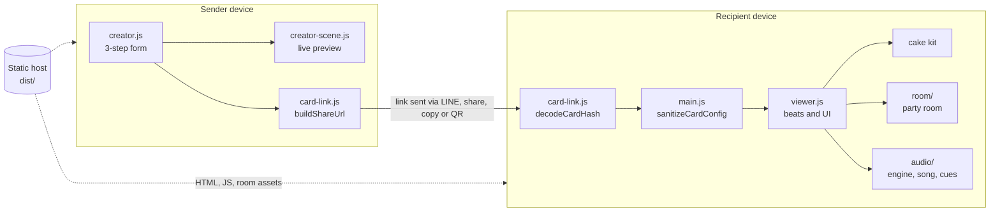
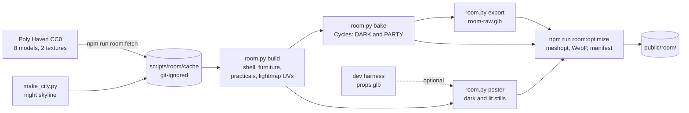
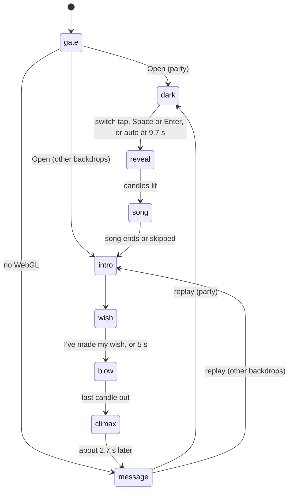
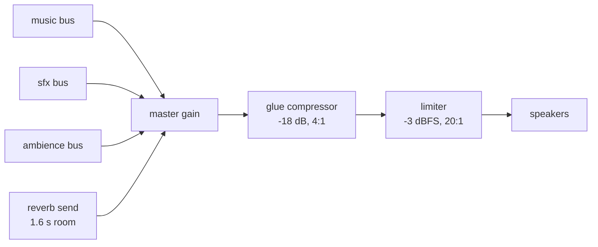

<a id="top"></a>

# Architecture / สถาปัตยกรรมระบบ

> เอกสารนี้เขียนจากโค้ดปัจจุบันบน `main` แต่ละหัวข้อเริ่มด้วยสรุปภาษาไทย ตามด้วยรายละเอียดภาษาอังกฤษ
> Written from the current code on `main`. Each section opens with a Thai summary, followed by the English detail.

## Contents

1. [Overview](#overview)
2. [Routes and loading](#routes)
3. [Modules](#modules)
4. [Share-link codec](#codec)
5. [Sanitizer](#sanitizer)
6. [Cake kit and caches](#cake)
7. [Backdrops](#backdrops)
8. [Surprise room pipeline](#room)
9. [Receiver state machine](#receiver)
10. [Fallbacks: poster mode, classic stage, no WebGL](#fallbacks)
11. [Audio engine and microphone](#audio)
12. [Internationalisation](#i18n)
13. [Performance: budgets and measurements](#performance)
14. [Testing and QA](#testing)
15. [Glossary](#glossary)

---

<a id="overview"></a>

## 1. Overview

**สรุป:** เว็บแอปหน้าเดียวแบบ static ไม่มีเซิร์ฟเวอร์หลังบ้าน ผู้สร้างเข้ารหัสการ์ดลงในแฮชของลิงก์ ผู้รับถอดรหัส กรองข้อมูล แล้วเล่นฉาก 3 มิติด้วย three.js ทุกอย่างทำในเบราว์เซอร์

A static single-page app (Vite 5, vanilla ES modules, three.js r160, anime.js, canvas-confetti). There is no backend: the creator encodes the card into the URL fragment, the receiver decodes it, sanitizes it and plays the scene. The only network traffic after the page load is static assets (JS chunks, fonts, room files, optional voice clips) and, if the sender added one, the photo URL.



<a id="routes"></a>

## 2. Routes and loading

**สรุป:** มีเส้นทางเดียวคือแฮช `#/` เป็นหน้าสร้างการ์ด ส่วน `#/c/...` และ `#/view/...` เป็นหน้าผู้รับ แต่ละหน้าโหลดโค้ดของตัวเองแยกกัน ผู้รับจึงไม่ต้องโหลดโค้ดผู้สร้าง

| Hash | Route | Module loaded |
|---|---|---|
| `#/` (or empty, or anything else) | Creator | `creator.js` (+ `creator-scene.js`) |
| `#/c/<payload>` | Receiver, current links (v2 / v2.1) | `viewer.js` |
| `#/view/?z=1.<payload>` | Receiver, v1 links | `viewer.js` |
| `#/view/<name>?d=<payload>` | Receiver, legacy links | `viewer.js` |

- `main.js` listens to `hashchange`, tears down the current view (`destroyCreator` / `destroyViewer`), then dynamically imports the route module. A route token makes sure only the latest navigation mounts if the user navigates while a chunk is downloading.
- The receiver decodes the link while `viewer.js` downloads, then passes the result through `sanitizeCardConfig()` before anything renders.
- Build-time chunking (`vite.config.js`): three.js in its own long-cached `three` chunk; the cake kit and backdrops in a shared chunk; the room (`src/room/index.js`) is a lazy chunk loaded only for party cards (and by the creator preview when "Surprise room" is picked).
- `routePreloadPlugin` adds `<link rel="modulepreload">` for chunks both routes use and a one-line inline script that preloads the chunks of the route the hash points at, so they download in parallel with the HTML.
- `iconsPlugin` regenerates `src/styles/icons.css` (Font Awesome paths as CSS masks) on dev start, on edits that could add an icon, and on build.

<a id="modules"></a>

## 3. Modules

**สรุป:** ตารางนี้บอกว่าไฟล์ไหนรับผิดชอบอะไร ใช้เป็นแผนที่ก่อนแก้โค้ด

| File | Responsibility |
|---|---|
| `src/main.js` | Hash router, Escape handling, share-link sanitizer |
| `src/card-link.js` | Encode and decode every link format; payload caps |
| `src/card-templates.js` | Name-driven starter wording (title, message, letter) in th / en / ja; used by the creator and by the decoder to rebuild untouched text |
| `src/backdrop-names.js` | Append-only backdrop list (no three.js import, safe for the entry chunk); `NEW_CARD_BACKDROP = 'party'` |
| `src/creator.js` | 3-step form, looks, templates and "dirty" tracking, colour pickers, draft autosave (`localStorage`), share sheet (LINE, native share, copy, QR, test link) |
| `src/creator-scene.js` | Creator preview: build off-scene, precompile, swap, then dispose; coalesces bursts of edits; builds the lit party room when that backdrop is chosen |
| `src/viewer.js` | Receiver: gate, scene preparation behind the gate, all beats, taps and keyboard, mic, poster mode, message card, letter, photo, thank-you, replay, resume after LINE |
| `src/cake-models.js`, `src/cake/parts.js`, `src/cake/models/*.js` | Cake layouts and registry, the construction kit (geometry, procedural textures, materials, caches), one builder per model |
| `src/cake/candles.js` | Candles and additive flame materials (`CANDLE_LOOKS` for dark and pale backdrops) |
| `src/backdrops.js` | Backdrop definitions, CSS gradients for pale backdrops, light-rig retuning, contact shadow |
| `src/render-quality.js` | Device class and tiers, ACES tone mapping, studio environment, bloom composer, `precompileScene`, FPS governor |
| `src/room/*` | The surprise room (see [section 8](#room)) |
| `src/audio/engine.js`, `song.js`, `cues.js` | Web Audio graph and limiter, the synthesized song, sound cues, optional recorded clips |
| `src/i18n.js` | Translations (en, th, ja), DOM translation, language persistence |
| `src/fonts.js` | On-demand card fonts, grapheme-safe text helpers for Thai |
| `src/vendor/qr.js` | Small QR encoder for the share sheet (lazy) |
| `src/room/dev/room-test.html` | Dev-only room harness (not a build input) |

<a id="codec"></a>

## 4. Share-link codec

**สรุป:** ลิงก์ปัจจุบันคือ `#/c/` ตามด้วยข้อมูลไบนารีแบบ base64url ค่าตัวเลือกทั้งหมดถูกอัดรวมเป็นบล็อกคงที่ 7 ไบต์ ชื่อผู้รับตามมา ข้อความที่ผู้สร้างไม่ได้แก้จะไม่ถูกส่งเลย ผู้รับสร้างใหม่จากชื่อและภาษา ลิงก์รูปแบบเก่าทุกแบบยังถอดรหัสได้ กติกาสำคัญคือ "เพิ่มต่อท้ายเท่านั้น" ห้ามเรียงลำดับใหม่

### 4.1 Formats

| Format | Shape | Header / marker | Diffed against | Status |
|---|---|---|---|---|
| **v2.1** | `#/c/<base64url>` | first byte `0x22` raw, `0x23` deflate-raw | `CARD_DEFAULTS` | Written today |
| v2 | `#/c/<base64url>` | `0x20` raw, `0x21` deflate-raw | `CARD_DEFAULTS` | Decode only |
| v1 | `#/view/?z=1.<base64url(deflate-raw(JSON))>` | `1.` prefix, short keys | `CARD_DEFAULTS` | Decode only; also the fallback writer if v2 encoding throws |
| legacy | `#/view/<name>?d=<base64url(JSON)>` | full key names | `LEGACY_DEFAULTS` | Decode only; last-resort writer without `CompressionStream` |

`LEGACY_DEFAULTS` exists because the pre-v2 creator omitted keys equal to *its* defaults (for example `decorStars: true`, `topper: 'best-senpai'`); decoding them against the current defaults would silently change old cakes. Legacy links whose name is a known placeholder (`Senpai`, `ครีม`) take the name from the path.

### 4.2 v2.1 byte layout

```text
byte 0        header: 0x22 (raw) or 0x23 (bytes 1.. are deflate-raw of the body)
bytes 1-7     packed settings, 56 bits little-endian (53 used, 3 spare)
varint        length of the recipient name in packed bytes
n bytes       recipient name (packed text, see 4.4)
rest          tagged extras: other strings, birth date, custom colours (see 4.5)
```

Deflate is tried only when the body exceeds 60 bytes, and kept only if it is smaller. Short cards therefore never need `CompressionStream`, which older iOS lacks.

### 4.3 Packed settings (bits, least significant first)

| Bits | Field | Width | Values (index order, append-only) |
|---|---|---|---|
| 0-3 | theme | 4 | neon-rose, midnight-gold, pastel-mint, lavender-dream, sakura-blossom, cyber-retro, forest-moss, cosmic-nebula, choco-monarch |
| 4-6 | preset | 3 | (none), pink-dream, chocolate-royal, mint-chocolate, midnight-gold, sakura-sweet, cosmic-crystal |
| 7-8 | music | 2 | happy-birthday-lofi, -piano, -synth |
| 9-10 | font | 2 | outfit, playfair, great-vibes |
| 11-13 | cakeModel | 3 | classic-tiered, vintage-heart, korean-bento, triple-luxury, cyber-prism |
| 14-15 | plate | 2 | ceramic, crystal, golden, cosmic |
| 16-17 | glaze | 2 | chocolate, strawberry, mint, cream |
| 18-19 | topper | 2 | hbd, star, best-senpai (heart), none |
| 20-21 | letterTheme | 2 | royal, romance, cyber, steampunk |
| 22-23 | relation | 2 | friend, partner, family, colleague |
| 24-25 | lang | 2 | th, en, ja (the sender's language, for templates) |
| 26-29 | candles | 4 | 0-15 (sanitized to 1-10) |
| 30-33 | strawberries | 4 | 0-15 (sanitized to 0-8) |
| 34-37 | cherries | 4 | 0-15 (sanitized to 0-8) |
| 38-40 | rolls | 3 | 0-7 (sanitized to 0-6) |
| 41 | sprinkles | 1 | |
| 42 | letterEnabled | 1 | |
| 43 | decorHearts | 1 | |
| 44 | decorStars | 1 | |
| 45 | belated | 1 | wording is the belated variant |
| 46-49 | templated | 4 | bit per field left as template: title, message, letterTitle, letterBody |
| 50-52 | backdrop | 3 | night, blush, cream, sky, mint, lavender, party |
| 53-55 | spare | 3 | must decode as 0 for older links |

A field appended later lands in spare bits; older links carry zeros there, which is index 0 of the new enum. The backdrop field was added this way, so v2.1 links made before backdrops existed decode to `night`.

### 4.4 Text packing

ASCII below `0x7F` is stored as is; the Thai block U+0E00 to U+0E7F as one byte `0x80 + offset`; anything else (emoji, Japanese) as `0x7F` followed by its UTF-8 bytes. Thai therefore costs one byte per character instead of three.

### 4.5 Tagged extras

| Tag range | Value size | Used for |
|---|---|---|
| 1-31 | varint length + packed text | 2 sender, 4 title, 5 message, 6 letterTitle, 7 letterBody, 8 topperText, 9 photo (1 recipientName in v2) |
| 32-63 | 1 byte enum index | v2 only (v2.1 packs enums) |
| 64-95 | 1 byte | 68 / 69 birth date high / low byte, as days since 1970-01-01 (v2 also uses 64-67 for counts) |
| 96-111 | 1 byte bit field | v2 only: 96 flags, 97 templated |
| 112-127 | 3 bytes RGB | 112 glaze, 113 cream, 114 plate, 115 candle, 116 topper, 117 envelope base, 118 flap, 119 seal |

A string is omitted when it equals its default or is still the template. Because each range fixes its value size, a decoder skips tags it does not know yet; a tag of 128 or above is an error. Tag numbers are append-only.

**Measured link lengths** (Node, current codec): a card with a Thai name and sender, all defaults and template wording, produces a 30-character fragment (`#/c/IgAAABTRxhsFobKilMwCA5XJmQ`); the same card with a custom Thai message, another model, theme and 7 candles is 72 characters after the domain.

### 4.6 Templates travel as bits

Untouched wording is not sent. The decoder calls `buildTemplates({ name, sender, relation, belated, lang })` with the sender's language and rebuilds the exact words. Consequence: **editing a `tpl*` string in `i18n.js` changes the text of every existing card that used it.** Treat those strings as part of the link format.

### 4.7 Decoding limits and failure

- Payloads longer than 12 000 characters are refused; inflated data is capped at 16 KB (a stream reader cancels past the cap), so a crafted link cannot decompress into a memory bomb.
- Varint lengths are limited to 3 continuation bytes and every read is bounds-checked (`Truncated card link`).
- `decodeCardHash()` never throws. A broken link yields the defaults (`format: 'error'`), so the recipient still gets a card rather than a blank page.

<a id="sanitizer"></a>

## 5. Sanitizer

**สรุป:** ข้อมูลจากลิงก์ถือว่าไม่น่าเชื่อถือ `sanitizeCardConfig()` บังคับทุกค่าให้อยู่ในรูปที่หน้าสร้างการ์ดทำได้จริง ก่อนจะแสดงผลอะไร

`main.js` rebuilds the config from the defaults and copies a value only if it passes:

| Kind | Rule |
|---|---|
| Enums | Must be a value of the creator's own controls in `#creator-form` (radio or select); `backdrop` also accepts every name in `BACKDROP_NAMES` |
| Text | Trimmed and clamped: name 40, sender 40, date 10, title 120, message 2000, letter title 120, letter body 4000, topper 16 characters |
| Date | Must match `YYYY-MM-DD`, else empty |
| Counts | Integers clamped: candles 1-10, strawberries 0-8, cherries 0-8, rolls 0-6 |
| Switches | Only real booleans |
| Colours | Only `#rrggbb` |
| Photo | Only a parseable `https:` URL |

All user text reaches the DOM through `textContent` (see [SECURITY.md](SECURITY.md)).

<a id="cake"></a>

## 6. Cake kit and caches

**สรุป:** เค้กทั้ง 5 ทรงสร้างจากโค้ดด้วยชุดชิ้นส่วนเดียวกัน วัสดุ พื้นผิว และรูปทรงถูกแคชไว้ การปรับค่าในหน้าสร้างการ์ดจึงไม่คอมไพล์ shader ใหม่และไม่รั่วหน่วยความจำ

- `cake-models.js` holds per-model layout metrics (radii, heights, candle ring) and `buildCakeModel(group, opts)`; each model lives in `src/cake/models/`.
- Draw-call tools: `partsToMesh()` bakes multi-part decorations that share a material into one mesh; `instanceRing()` draws a ring of identical beads in one call. The grand 3-tier cake went from about 700 meshes to well under half.
- Caches in `cake/parts.js`: deterministic textures are page-lifetime singletons (`permanentTexture`), parameterised ones sit in small LRU caches (`sharedTexture`), materials are memoised by constructor and parameters (`sharedMaterial`), geometries by key (`sharedGeometry`). Result measured in development: a creator rebuild dropped from 469 ms to about 5 ms with no texture or program growth.
- **Disposal contract:** free a cake with `disposeCakeGroup(group)` after removing it. It frees geometry immediately, skips kit-shared resources and releases the rest two frames later, after the replacement has rendered and taken over the compiled programs. Never mutate a shared material.
- Candles share one warm point light whose intensity follows the number of lit flames; it dims to 0 rather than being removed, because changing the light count recompiles every material.

<a id="backdrops"></a>

## 7. Backdrops

**สรุป:** มี 7 ฉาก `party` คือห้องเซอร์ไพรส์ `night` คือฉากมืดเดิม อีก 5 ฉากสีอ่อนวาดด้วย CSS หลัง canvas โปร่งใส การเปลี่ยนฉากเปลี่ยนแค่ค่า uniform และสถานะ GL ไม่คอมไพล์ใหม่

| Name | Index | How it renders |
|---|---|---|
| `night` | 0 | Opaque dark stage with fog, stars and neon floor glow; what every link without a backdrop decodes to |
| `blush`, `cream`, `sky`, `mint`, `lavender` | 1-5 | Transparent canvas over an exact CSS gradient (ACES tone mapping cannot reach such pale colours from an 8-bit texture), lower exposure, re-balanced key / fill / rim, fog colour, bloom threshold, a one-draw-call contact shadow, and a saturated flame look |
| `party` | 6 | The 3D surprise room (`room: true`); default for new cards |

Each backdrop also carries UI text tokens (ink, soft, accent) chosen for at least 4.5:1 contrast over its mid colour.

<a id="room"></a>

## 8. Surprise room pipeline

**สรุป:** ห้องถูกสร้างและจัดแสงใน Blender แบบ headless เบคแสง 2 ชุด (มืด และ ไฟปาร์ตี้) แล้วบีบอัดเป็นไฟล์เว็บ ในเบราว์เซอร์ วัสดุผสมไลต์แมปสองชุดด้วย uniform เดียว จึงเปิดไฟได้โดยไม่คอมไพล์ shader ใหม่ ของตกแต่งปาร์ตี้สร้างด้วยโค้ดตอนรันไทม์

### 8.1 Offline build



- `scripts/room/layout.json` is the shared layout (three.js space, metres); `src/room/layout.js` mirrors the numbers that matter at runtime. Keep them in sync.
- `room.py` stages: `build`, `preview`, `relight`, `bake`, `export`, `poster` (Blender 5.2, `--background --factory-startup`). Light groups: **DARK** = city window and night sky, corridor spill, switch LED; **PARTY** = four downlights, pendant, floor lamp, fairy lights. The candle and all party props are real time, not baked.
- Lightmaps are stored 8-bit as `sqrt(E / Emax)` (more code values in the shadows, where banding shows); `Emax` per set is written to `room.json`.
- `optimize.mjs` writes two tiers: `room-high.glb` (textures up to 1024) with 2k lightmaps, and `room-low.glb` (textures up to 512, floor and walls 1024) with 1k lightmaps, plus the posters and `room.json`. Geometry is welded, reordered, quantized and meshopt-compressed.
- The sofa, TV console, split AC unit, rug, curtains and room shell are procedural in `room.py` (no licence needed). Step-by-step commands are in [DEPLOYMENT.md](DEPLOYMENT.md#rebuild-room).

**Shipped assets (`public/room/`)**

| File | Size | Used by |
|---|---|---|
| `room-low.glb` + `lm-dark-1k.webp` + `lm-party-1k.webp` | 1.14 MB + 70 KB + 115 KB = 1.33 MB | Tiers 0 and 1 (phones) |
| `room-high.glb` + `lm-dark-2k.webp` + `lm-party-2k.webp` | 1.75 MB + 166 KB + 246 KB = 2.16 MB | Tier 2 (desktop) |
| `city-night.webp` | 41 KB | Window view (both tiers) |
| `poster-dark.webp`, `poster-lit.webp` | 21 KB, 62 KB | Gate background, poster mode, creator swatch |
| `vendor/meshopt_decoder.module.js` | 25 KB | Worker-capable decoder (see below) |

### 8.2 Runtime

`createPartyRoom({ renderer, scene, camera, quality, config, onProgress, signal })` in `src/room/index.js` resolves when the room is renderable in its dark state.

| Piece | File | What it does |
|---|---|---|
| Streaming | `loader.js` | Fetches `room.json`, then the tier's GLB and both lightmaps (one shared promise per file, so `prefetchPartyRoom()` at gate mount and the real load never download twice). Images decode off the main thread. Abortable; any failure rejects and the greybox stays. |
| Greybox | `shell.js` | A procedural room lit by the real-time rig, shown while the baked room streams in and kept if it fails. Also the city window and the wall switch (plate, rocker, breathing LED, hit box). |
| Baked materials | `materials.js` | `MeshStandardMaterial` whose diffuse light is only `dark * kDark + party * kParty + candle term`. Real-time lights are zeroed on these surfaces (already in the bake); the env map is scaled by `uEnvK` so the dark room does not mirror the lit capture. |
| Constant rig | `rig.js` | Exactly three lights from first frame to last: candle point light, pendant spot light (shadow on tier 2 only), hemisphere fill. They light the dynamic things (cake, balloons, letters, gifts, confetti). The reveal changes only their intensity and colour. |
| Reflections | `env-capture.js` | Cube captures of this room from above the table, prefiltered with PMREM: one lit and one dark. Programs are compiled behind the gate and buffers uploaded in small batches; captures run one face per task after the room resolves. Swapping dark and lit maps at the flip changes no program. Re-captured after a WebGL context restore. |
| Party props | `party/*.js` | Latex balloons (one instanced mesh, rim-light shader tweak), foil letters inflated from the glyph by a distance transform (two draw calls for HAPPY BIRTHDAY), fairy lights, bunting, LED name sign drawn with the page's Noto Sans Thai, gifts, hats, pooled 3D confetti, balloon drop. Colours come from a per-theme palette. |
| Layout and shots | `layout.js` | Metres, y up, scaled by `ROOM_SCALE = 14` so the cake keeps scale 1. Camera shots `entry`, `reveal`, `wide`, `cake`, `closeUp`, with portrait variants that keep the letters and the name sign in frame. |

**Why there is no stutter at the reveal:** three.js compiles a program per material and light configuration. The room keeps the light count, shadow settings and material set identical in the dark and lit states, so `setLights(0..1)` and `setDim(0..1)` only write uniforms and intensities. Measured in development: 67 programs on phones, constant from the dark room to the end.

**Tiers** (`getDeviceClass()` in `render-quality.js`, decided once per page; rotation only resizes)

| | Tier 0 | Tier 1 | Tier 2 |
|---|---|---|---|
| Who | Phone with 4 or fewer cores or 3 GB or less memory | Other phones and small tablets | Desktop and laptop |
| Pixel-ratio cap | 1.25 | 1.75 (2 with 6+ cores and 6+ GB) | 2 |
| Room files | low | low | high |
| Balloon clusters / drop | 19 / 8 | 27 / 11 | 27 / 14 |
| Fairy-light bulbs (window strands / wall swag) | 7 x 8 / 24 | 11 x 12 / 40 | 11 x 12 / 40 |
| Pendant shadow | off | off | on |
| Balloon sway | off | on | on |

A phone is recognised by touch plus a short screen side (600 CSS px or less) or a mobile UA hint, not by viewport width, so a phone in landscape keeps the phone tier.

**meshopt decoder note:** the decoder starts its workers from its own function source; minification renames what that source refers to, so the bundled copy can only decode on the main thread. Production therefore imports the untouched MIT copy from `public/room/vendor/` at runtime (two workers); dev uses the bundled copy; if the vendor copy fails, the bundled one decodes on the main thread. Hosts must serve that file unmodified.

<a id="receiver"></a>

## 9. Receiver state machine

**สรุป:** หน้าผู้รับทำงานเป็นลำดับฉาก (phase) ห้องเซอร์ไพรส์เพิ่มฉาก มืด เปิดไฟ และร้องเพลง ก่อนอธิษฐาน ฉากทั้งหมดถูกสร้างและคอมไพล์ไว้ระหว่างที่ผู้รับอ่านซองจดหมาย กดเปิดแล้วจึงเริ่มได้ทันที ทุกการเคลื่อนไหวคิดตามเวลา ไม่ใช่ตามจำนวนเฟรม



- **Behind the gate:** `prepareScene()` builds renderer, cake, candles, room (party) and precompiles every program for the bloom target in 12 ms slices, while the gate is read. Party cards also decode both posters first, so the Open button can go "early" long before the 3D room has streamed in.
- **Open** unlocks audio synchronously inside the tap (iOS). **Open quietly** (quiet mode) plays everything muted until the speaker is tapped, then fades in over 1.5 s.

**Party beat sheet** (T0 = the switch tap)

| When | What |
|---|---|
| Dark +0 | Exposure starts at 0.3x and rises over 2.2 s (eye adaptation); slow 3 % push into the room; room tone; FPS probe |
| Dark +1.1 s | Hint "ทำไมมืดจัง… ลองเปิดไฟดูสิ" and a skip button |
| Dark +5 s | Hint escalates ("แตะสวิตช์ไฟ"), the switch pulses, eyes fully adapted (+0.4 EV), the view turns up to 10 degrees toward the switch |
| Dark +9 s | "เปิดไฟให้แล้วนะ" note, automatic flip 0.7 s later |
| T0 | Switch click, haptic, room goes quiet |
| T0 + 120 ms | Lights on: hard cut, exposure overshoot 1.35x settling in 0.7 s; camera flinches back 2.5 % |
| T0 + 150 ms | Shout (recorded clip if present, else wordless crowd), two poppers, "เซอร์ไพรส์!" text, confetti from both sides, 3D confetti; head turn to the reveal framing over 650 ms |
| T0 + 1.9 s | One 1.8 s glide from the doorway to the table; the name pill docks |
| T0 + 4.4 s | "ปิดไฟ จุดเทียน!": room dims over 0.8 s, candles ignite |
| then | The song (13.5 s) with a karaoke line; camera drifts 8 degrees; drag takes over; skip after 3 s |
| then | Push-in to the flames (2.6 s), wish (button after 1.8 s, auto after 5 s) |
| blow | Tap a flame, the cake, Space or Enter; mic optional |
| climax | 380 ms of darkness and silence, final phrase, lights snap back, balloon drop, cheer, sparkles, confetti |
| +2.3 s | Message card with end actions |

**Reduced motion:** cross-cuts replace glides, no flinch, no poppers or balloon drop, softer exposure kick and less confetti. **Keyboard:** Space / Enter flips the switch, starts blowing and blows the next candle; Escape closes the photo preview, letter, mic sheet or card. **Screen readers:** key moments are announced in an `aria-live` region.

**End actions:** thank the sender (in LINE: a LINE share window with a prefilled thank-you, and a `sessionStorage` marker so coming back resumes on the end screen for up to 30 minutes; elsewhere `navigator.share`, else a LINE share URL); replay (the lights go off again); save photo (a composed off-screen render at 1080x1350 portrait or 1600x1200 landscape, shown for long-press on iOS and in LINE, downloaded elsewhere); make your own (`#/`).

<a id="fallbacks"></a>

## 10. Fallbacks

**สรุป:** มี 4 ทางถอย เปิดก่อนห้องโหลดเสร็จใช้ภาพนิ่ง แล้วค่อยต่อเข้า 3 มิติ เครื่องวาดไม่ทันใช้ภาพนิ่งตลอด ห้องโหลดไม่ได้ใช้ฉากคลาสสิก ไม่มี WebGL แสดงการ์ดข้อความอย่างเดียว

| Trigger | Result |
|---|---|
| Recipient taps Open before the 3D room is ready (party) | **Poster mode:** the show starts at once on the baked dark still with CSS light, the same beats, DOM candle buttons (at least 56 px) and canvas confetti. When the room is ready it joins in at a clean point (the dark room, or the reveal before the candles). Measured in development: an early tap on iPhone SE in LINE over Slow 4G went from about 16 s of waiting to about 0.6 s. |
| Median frame slower than 50 ms (under 20 fps) in two consecutive 1.4 s windows during the dark or reveal beat | Poster mode for the rest of the session (a replay stays 2D) |
| Room not ready after 20 s, or it failed | Classic night stage with the same cake |
| No WebGL, or scene preparation failed | The gate still opens to the message card with a note; no 3D |

The FPS governor (`createQualityGovernor`) works independently: after 45 warm-up frames it averages 1 s windows, steps down after two windows under 40 fps (pixel ratio x0.75, then 1.0, then bloom off, then shadows every 4th frame, then a decoration budget) and up after five windows at 55 fps or more, freezing after three reversals.

<a id="audio"></a>

## 11. Audio engine and microphone

**สรุป:** เสียงทุกเสียงสังเคราะห์ในเบราว์เซอร์ ผ่านคอมเพรสเซอร์และลิมิตเตอร์ จึงไม่มีเสียงดังกะทันหัน ทุกเสียงตั้งเวลาด้วยนาฬิกาเสียง จึงตรงจังหวะแม้เฟรมจะหนัก ไมโครโฟนใช้เมื่อผู้รับยินยอมเท่านั้น



- `engine.js` must be created inside the Open tap (iOS unlock: a one-sample silent buffer; Safari 16.4+ `audioSession.type = 'playback'` so the ring switch does not mute it). Every transient gets a fade-in of at least 20 ms.
- `song.js`: Happy Birthday (public-domain melody) with harmony and bass, 13.5 s per pass, lyric start times for the karaoke strip. The card's music choice only changes the melody timbre: lofi triangle, piano sine, synth sawtooth.
- `cues.js`: room tone, switch click, poppers, whoosh, match strike, wordless crowd and applause, party loop, puff, tick, pop, chime, paper, shutter. All take an audio-clock time, so a beat is laid out once and stays sample-accurate.
- Recorded voices: `public/audio/clips.json` maps `surprise`, `cheer`, `whisper` to files in the same folder (plain file names with an audio extension only). It ships empty; a missing clip falls back to synthesis (or silence for the whisper). Recording guide: [public/audio/README.md](public/audio/README.md).
- **Microphone:** opt-in behind an explainer, only in a secure context, never in the LINE in-app browser (an "open in browser" link is offered). `getUserMedia` with echo cancellation on, noise suppression and AGC off; an analyser (FFT 256) averages the 2.8 to 7.5 kHz band where breath noise lives. 0.5 s of calibration sets the floor (80th percentile); the threshold is `max(floor + 26, 60)`; a puff must last 0.12 s, then one candle goes out every 0.18 s. Flames lean with the breath below threshold. Tracks are stopped when blowing ends.

<a id="i18n"></a>

## 12. Internationalisation

**สรุป:** มี 3 ภาษา ไทย อังกฤษ ญี่ปุ่น ทุกภาษามีคีย์ครบเท่ากัน (ตอนนี้ 308 คีย์) ภาษาเลือกจากค่าที่บันทึกไว้หรือภาษาของเบราว์เซอร์ วลีภาษาไทยสำคัญไม่ถูกตัดขึ้นบรรทัดใหม่กลางคำ

- `translations = { en, th, ja }` in `src/i18n.js`, 308 keys each (checked with the command in [CONTRIBUTING.md](CONTRIBUTING.md#i18n)). Markup uses `data-i18n` and `data-i18n-aria`; the receiver fills text from code with `textContent`.
- Language: stored choice (`localStorage` key `hbd_craft_lang`) or the browser language, falling back to English; `<html lang>` follows it.
- Card wording comes from `tpl*` keys through `card-templates.js` in the **sender's** language, carried in the link (see [4.6](#codec)).
- Thai typography: the receiver keeps phrases such as สุขสันต์วันเกิด and เซอร์ไพรส์ together when wrapping, and the topper text counts graphemes, not code units.

<a id="performance"></a>

## 13. Performance: budgets and measurements

**สรุป:** ตัวเลขทั้งหมดวัดระหว่างพัฒนาด้วย Chromium แบบ headless บน Windows (RTX 3050) พร้อมจำลอง CPU ช้าลงและเน็ตช้า ยังไม่ใช่ผลจากมือถือจริง ใช้เป็นแนวโน้ม ไม่ใช่คำรับรอง

**Budgets**

| Budget | Target |
|---|---|
| Extra download for the room on phones | 3.5 MB or less |
| Draw calls on phones | 150 or less |
| Shader programs after the dark room is shown | No change (no compile at the reveal) |
| Main-thread tasks while preparing behind the gate | Under 100 ms each |
| Frame rate | 60 fps desktop; at least 30 fps on a mid Android (4x CPU throttle) |

**Measurements**

| What | Value | Source |
|---|---|---|
| JS over the wire, gzip (build of the current `main`) | three 171 KB, viewer 42 KB, cake kit and backdrops 31 KB, entry 23 KB, room 19 KB, creator 15 KB, QR 3 KB; CSS 26 KB; HTML 11 KB | `vite build`, this revision |
| Room assets | Phones 1.33 MB, desktop 2.16 MB (+ 41 KB city, 83 KB posters) | `public/room/room.json` |
| Whole phone visit | About 1.75 MB; the gate is usable after 130 to 384 KB | Mobile QA emulation, before commit d9f76ac |
| Programs on phones | 67, constant from the dark room to the end | Commits 0e0504d, d9f76ac |
| Draw calls on phones | Dark 45 to 50, lit 146 to 154 | Mobile QA emulation, before d9f76ac |
| Dark room mean luminance | Desktop 5.1 %, phone 8.1 %; lights-on contrast 9.4x and 5.3x | Commit 89b14c6 |
| Early open on a slow network | About 16 s waiting reduced to about 0.6 s (poster entry) | Commit d9f76ac |
| Landscape phone texture memory | 201 MB reduced to 66 MB (phone tier kept) | Commit d9f76ac |
| Classic stage, tap to first 3D frame | 0.11 s desktop, 0.45 s phone (was 7.9 s and 8.7 s) | Commit 6808c63 |
| Mid Android, 6x CPU throttle, after the reveal | About 26 to 30 fps, below the 30 fps goal | Mobile QA emulation, before d9f76ac; real-device check pending |

<a id="testing"></a>

## 14. Testing and QA

**สรุป:** ตอนนี้มีการตรวจอัตโนมัติคือ ESLint และ build ใน CI เท่านั้น ส่วนการวัดประสิทธิภาพและภาพหน้าจอทำด้วยสคริปต์เบราว์เซอร์และการทดสอบด้วยมือ ยังไม่มี unit test

| Check | How |
|---|---|
| Lint | `npm run lint` (ESLint 9 flat config: recommended rules, unused variables warn). `npm run build` runs it first; an error fails the build. |
| CI | `.github/workflows/ci.yml`: Node 20, `npm ci`, `npm run build` on pushes and pull requests to `main`. |
| Room harness | `npm run dev`, then `/src/room/dev/room-test.html?state=dark\|mid\|lit\|dim&shot=entry\|wide\|cake\|closeUp&q=0..2&theme=..&name=..&model=..` (`clean` hides the HUD, `trace` logs slow compiles, `checks` re-enables shader error checks). `window.__room.stats()` returns draw calls, triangles, programs, fps and load time; `window.__room.exportProps()` exports the props for the Blender poster stage. |
| Screenshots | `npm run screenshots` drives Chrome through the real flow (creator, share, gate, dark, reveal, song, finale, message) and writes `screenshots/`. |
| Manual pass | Before a release: create a Thai card, open it on a phone inside LINE, go through every beat, deny and allow the mic, save a photo, thank the sender, replay; repeat with reduced motion and quiet mode; open one old `#/view/` link. |

Headless GPU measurement scripts used during development (fps per beat, program counts, long tasks, luminance) are not part of the repository.

<a id="glossary"></a>

## 15. Glossary / อภิธานศัพท์

| Term | ความหมาย | Meaning |
|---|---|---|
| Beat / phase | ช่วงหนึ่งของเรื่องราวผู้รับ เช่น มืด เปิดไฟ ร้องเพลง | One step of the receiver story (dark, reveal, song...) |
| Bake, lightmap | แสงที่คำนวณล่วงหน้าใน Blender เก็บเป็นภาพ | Light precomputed in Blender and stored in textures |
| Program / recompile | โปรแกรม shader ของ GPU การสร้างใหม่ทำให้กระตุก | A GPU shader program; building one causes a hitch |
| PMREM | การเตรียมภาพสะท้อนให้วัสดุมันวาวใช้ | Prefiltered environment map for glossy reflections |
| Greybox | ห้องรูปทรงง่ายระหว่างรอไฟล์จริง | Simple stand-in room while assets stream |
| Poster mode | แสดงเรื่องราวบนภาพนิ่งเรนเดอร์ แทน 3 มิติ | The show on baked stills instead of live 3D |
| Tier | ระดับเครื่อง 0 / 1 / 2 | Device class 0 / 1 / 2 |
| Governor | ตัวลดคุณภาพอัตโนมัติตามเฟรมเรต | Automatic quality step-down by frame rate |
| Varint | ตัวเลขความยาวแปรผัน 7 บิตต่อไบต์ | Variable-length integer, 7 bits per byte |
| base64url | การเข้ารหัสไบนารีเป็นตัวอักษรที่ใส่ในลิงก์ได้ | Binary-to-text encoding safe in URLs |
| deflate-raw | การบีบอัดข้อมูลในตัวเบราว์เซอร์ | Built-in browser compression (CompressionStream) |
| Append-only | เพิ่มต่อท้ายได้ ห้ามลบหรือเรียงใหม่ เพื่อให้ลิงก์เก่ายังเปิดได้ | Add at the end only, never reorder, so old links keep working |
| meshopt | การบีบอัดโมเดล 3 มิติที่ถอดรหัสเร็ว | Fast-decoding mesh compression |
| ROOM_SCALE | ตัวคูณจากเมตรเป็นหน่วยของเค้ก (14) | Metres to cake units (14) |

<p align="right"><a href="#top">Back to top</a></p>
