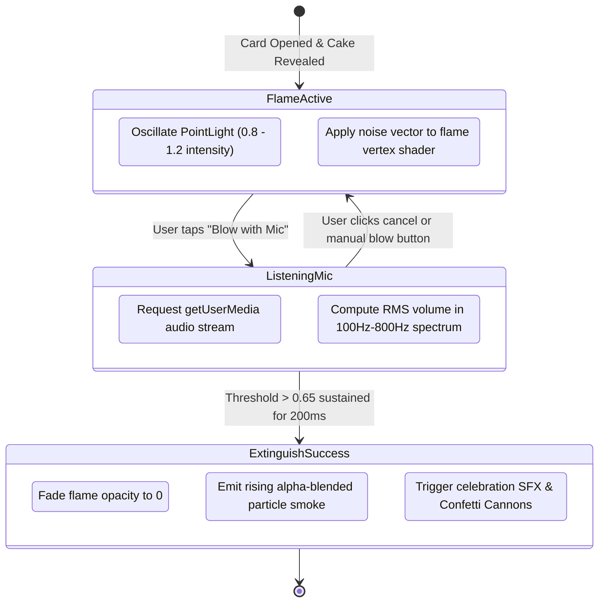

# HBD 3D Craft System Architecture Specification

## 🏗️ 1. High-Level Architectural Design

**HBD 3D Craft** operates on a **Zero-Backend, Stateless Client Architecture**. All 3D procedural geometries, physics simulations, audio processing, and state serialization occur natively within modern browser APIs.

```mermaid
graph TD
    User["User (Creator / Receiver)"] --> Gateway["Edge CDN (Cloudflare Pages / Vercel)"]
    
    subgraph ClientEngine["Client Application (Vite + Vanilla JS)"]
        Router["Hash Router & State Dispatcher\n(src/main.js)"]
        CreatorUI["Creator Dashboard & Theme Builder\n(src/creator.js)"]
        ViewerStage["3D WebGL Viewer & Interaction Stage\n(src/viewer.js)"]
        AudioEngine["Web Audio API & Sound Manager"]
        I18nEngine["3-Language Dictionary\n(src/i18n.js)"]
    end
    
    subgraph ThreeJSRenderer["Three.js 3D WebGL Pipeline"]
        CakeGenerator["Procedural Cake Mesh Extruder\n(Tiers, Glazes, Beaded Cream)"]
        ToppingGroup["Fruit & Chocolate Mesh Group\n(Strawberries, Cherries, Sprinkles)"]
        FlameShader["Oscillating Candle Flame & Smoke Particles"]
        OrbitControl["Smooth Camera Controller & DPR Scaler"]
    end
    
    subgraph WebAudioSubsystem["Microphone Wind Detection Engine"]
        MediaStream["navigator.mediaDevices.getUserMedia()"]
        AnalyserNode["AnalyserNode (FFT 256)"]
        WindFilter["Low-Frequency (100Hz - 800Hz) Energy Evaluator"]
    end
    
    Gateway --> Router
    Router -->|Mode: Create| CreatorUI
    Router -->|Mode: View (#card=...)| ViewerStage
    
    ViewerStage --> ThreeJSRenderer
    ThreeJSRenderer --> CakeGenerator
    ThreeJSRenderer --> ToppingGroup
    ThreeJSRenderer --> FlameShader
    
    ViewerStage --> WebAudioSubsystem
    MediaStream --> AnalyserNode --> WindFilter
    WindFilter -->|Blow Detected| FlameShader
```

---

## 🎂 2. Procedural 3D Cake Mesh Generation

The cake model is generated mathematically in real time based on configuration parameters:

1. **Base Cylinders (Tiers):** `CylinderGeometry` with bevel subdivisions to simulate soft sponge cake foundations.
2. **Hand-Piped Cream Shell:** Generated via a parametric circular path (`CatmullRomCurve3`) placing instanced spherical droplets with normal displacement to mimic pastry nozzle piping.
3. **Glossy Glaze:** Extruded top-cap geometry layered with `MeshPhysicalMaterial` ($0.9$ clearcoat, $0.1$ roughness) simulating mirror glaze.
4. **Procedural Fruit Toppings:** Custom lathe & sphere geometries textured with procedural berry seed bump maps and realistic translucent subsurface scattering simulation.

---

## 🎤 3. Microphone Candle Blowing State Machine



---

## 🔗 4. Stateless URL Payload Serialization

Card configurations are serialized to JSON, converted to a URL-safe Base64 string, and stored in the URL hash fragment (`#card=...`):

```json
{
  "name": "Alex",
  "msg": "Happy Birthday! Wishing you joy and success in the coming year! 🎂",
  "theme": "midnight-gold",
  "music": "piano",
  "cake": {
    "tiers": 2,
    "glaze": "chocolate",
    "piping": "white-cream",
    "toppings": ["strawberries", "cherries", "sprinkles"],
    "candleCount": 1
  }
}
```

- **Zero Database Reliance:** Eliminates server infrastructure, databases, and operational costs.
- **Privacy-Preserving:** The URL payload is decoded strictly on the recipient's device and is never logged on any backend server.
