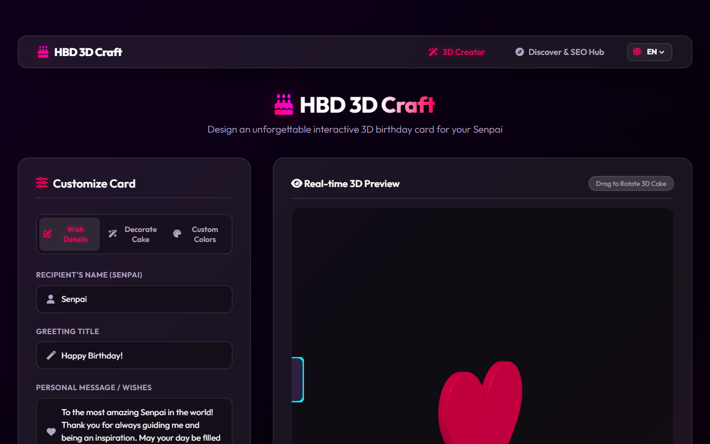
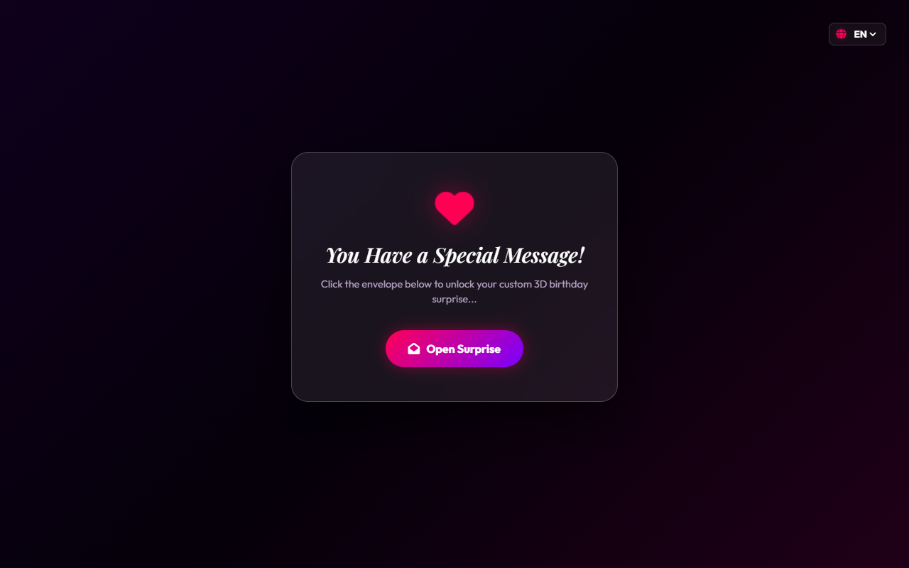
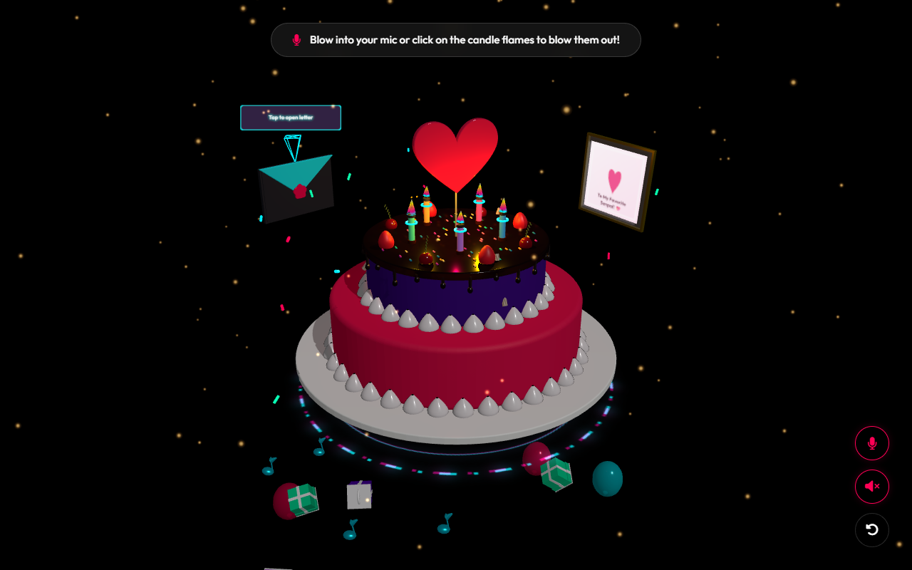
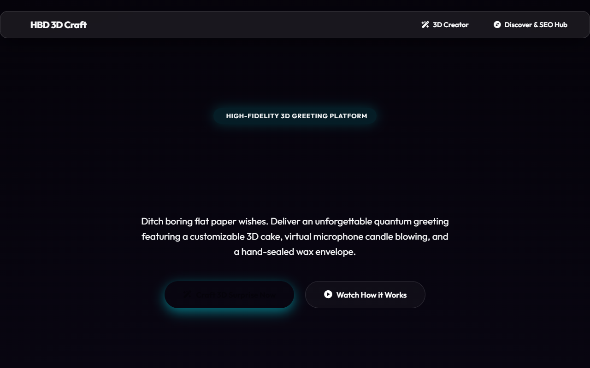

# 🎂 HBD 3D Craft — Interactive 3D Birthday Card Creator

<div align="center">



<br>

**Design stunning, highly interactive 3D birthday cards online — no coding required!**

[](./LICENSE)
[](https://threejs.org/)
[](https://vitejs.dev/)
[](./CONTRIBUTING.md)

[🚀 Live Demo](https://hbd-3d-craft.pages.dev) · [🐛 Report Bug](https://github.com/GitBababoo/Happy-Birthday/issues) · [💡 Request Feature](https://github.com/GitBababoo/Happy-Birthday/issues)

</div>

---

## ✨ Features

| Feature | Description |
|---|---|
| 🎂 **WebGL 3D Cake Designer** | Customize stunning 3D cakes with glazes, toppings, cherries, strawberries, chocolate rolls, and sprinkles in real-time |
| 🎤 **Microphone Candle Blowing** | Receivers blow directly into their mic to extinguish realistic 3D candle flames via Web Audio API frequency analysis |
| 💌 **Interactive 3D Envelope Letter** | A floating, CSS-animated 3D envelope with wax seal opens to reveal a handwritten letter |
| 🎨 **9 Visual Themes** | Neon Rose, Midnight Gold, Ocean Breeze, Lavender Dream, Sakura Bloom, Cyber Retro, Forest Moss, Cosmic Void, Choco Gold |
| 🔗 **Shareable URLs** | All card configurations are Base64-encoded directly into the URL — no database or server required |
| 🌐 **Multi-language (i18n)** | Supports English, Thai (ภาษาไทย), and Japanese (日本語) |
| 📱 **Fully Responsive** | Works on phones, tablets, and desktops |
| 🎵 **Background Music** | 3 curated ambient tracks (Lo-Fi, Piano, Synth Pop) |

---

## 📸 Screenshots

| Creator Dashboard | Envelope Gate |
|---|---|
|  |  |

| 3D Cake Reveal | Discover & SEO Hub |
|---|---|
|  |  |

---

## 🚀 Getting Started

### Prerequisites

- [Node.js](https://nodejs.org/) v18 or higher
- npm v9 or higher

### Installation

```bash
# 1. Clone the repository
git clone https://github.com/GitBababoo/Happy-Birthday.git
cd Happy-Birthday

# 2. Install dependencies
npm install

# 3. Start development server
npm run dev
```

The app will be live at **http://localhost:5173**

### Build for Production

```bash
npm run build
npm run preview
```

---

## 🛠️ Tech Stack

- **[Three.js](https://threejs.org/)** — WebGL 3D cake rendering, particles, and animations
- **[Anime.js](https://animejs.com/)** — Smooth UI micro-animations and transitions
- **[Canvas Confetti](https://github.com/catdad/canvas-confetti)** — Celebration confetti effects
- **[Vite](https://vitejs.dev/)** — Fast ES module bundler and dev server
- **Web Audio API** — Real-time microphone frequency analysis for candle blowing
- **CSS Glassmorphism + HSL Tokens** — Dynamic multi-theme design system

---

## 📁 Project Structure

```
Happy-Birthday/
├── index.html              # Main SPA (Creator + Receiver views)
├── discover.html           # SEO & Discovery Hub page
├── src/
│   ├── main.js             # App router & controller
│   ├── creator.js          # Creator dashboard logic
│   ├── viewer.js           # Interactive 3D WebGL receiver card
│   ├── i18n.js             # Internationalization (EN / TH / JA)
│   └── style.css           # Global design system & themes
├── public/
│   ├── robots.txt
│   └── sitemap.xml
├── screenshots/            # App screenshots
└── vite.config.js
```

---

## 🎯 How It Works

1. **Create** — Fill in the recipient's name, write a personal message, choose a theme and decorate your 3D cake
2. **Generate** — Click "Generate & Share Card" to get a unique shareable URL
3. **Share** — Send the link via LINE, WhatsApp, Instagram, or any messaging app
4. **Surprise!** — The recipient opens the link and can blow out candles with their microphone 🎉

---

## 🤝 Contributing

Contributions are warmly welcome! Please read our [Contributing Guidelines](./CONTRIBUTING.md) before submitting a pull request.

---

## 🔒 Security

Found a vulnerability? Please see our [Security Policy](./SECURITY.md) for responsible disclosure guidelines.

---

## 📄 License

This project is licensed under the **MIT License** — see the [LICENSE](./LICENSE) file for details.

---

## 💖 Acknowledgements

- Inspired by the desire to make birthday wishes more meaningful and memorable
- Built with love for all the Senpais out there 🎂✨

<div align="center">
Made with ❤️ by <a href="https://github.com/GitBababoo">GitBababoo</a>
</div>
