<a id="top"></a>

<p align="center">
  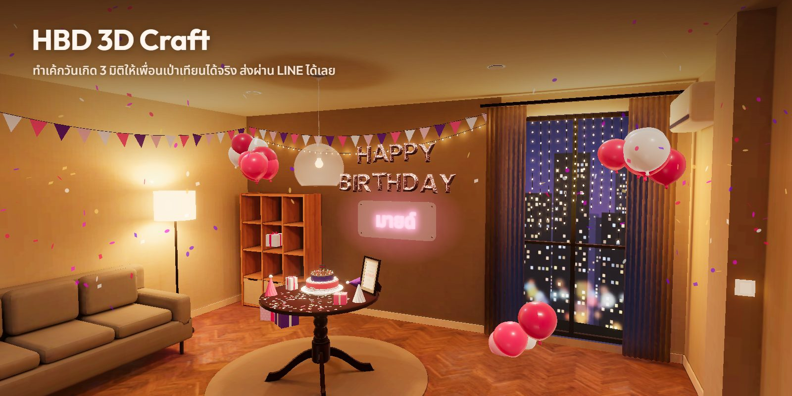
</p>

<h1 align="center">HBD 3D Craft</h1>

<p align="center">
การ์ดวันเกิด 3 มิติที่ส่งเป็นลิงก์เดียว ผู้รับเดินเข้าห้องมืด เปิดไฟ แล้วเจอปาร์ตี้เซอร์ไพรส์ที่มีชื่อของเขา<br>
A 3D birthday card sent as one link: the recipient walks into a dark room, flips the switch and finds a surprise party with their name on it.
</p>

<p align="center">
  <a href="#th"><b>ภาษาไทย</b></a> &nbsp;|&nbsp; <a href="#en"><b>English</b></a> &nbsp;|&nbsp; <a href="ARCHITECTURE.md">Architecture</a> &nbsp;|&nbsp; <a href="DEPLOYMENT.md">Deployment</a> &nbsp;|&nbsp; <a href="CHANGELOG.md">Changelog</a>
</p>

<p align="center">
  <a href="https://github.com/Gubbitkeytoday/hbd-3d-craft/actions/workflows/ci.yml"></a>
  <a href="LICENSE"></a>
  
  
</p>

---

## ภาพรวมประสบการณ์ / The experience at a glance

<table>
  <tr>
    <td width="50%" valign="top">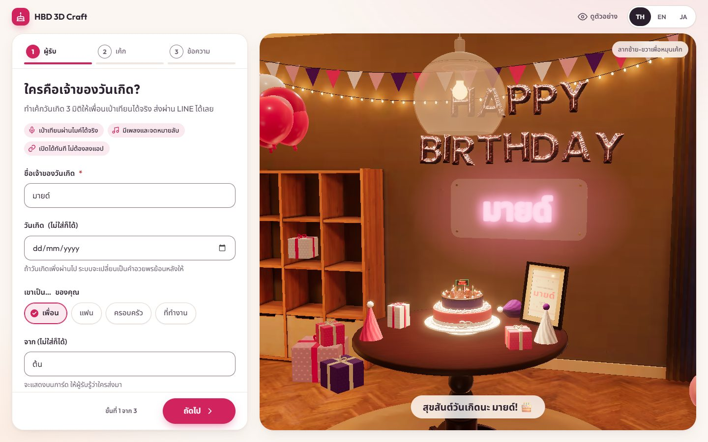<br><b>1. สร้างการ์ด</b> กรอกชื่อผู้รับ ผู้ส่ง วันเกิด และความสัมพันธ์ ข้อความตั้งต้นถูกเขียนให้ทันที<br><sub>Create: recipient, sender, birthday and relation. Starter wording is written for you.</sub></td>
    <td width="50%" valign="top">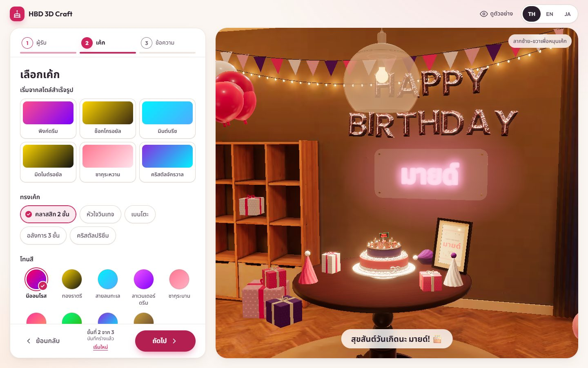<br><b>2. เลือกเค้กและฉาก</b> ทรง โทนสี ท็อปปิ้ง และฉาก พรีวิว 3 มิติอัปเดตตามทันที<br><sub>Pick the cake: shape, mood, toppings and backdrop, with a live 3D preview.</sub></td>
  </tr>
  <tr>
    <td valign="top">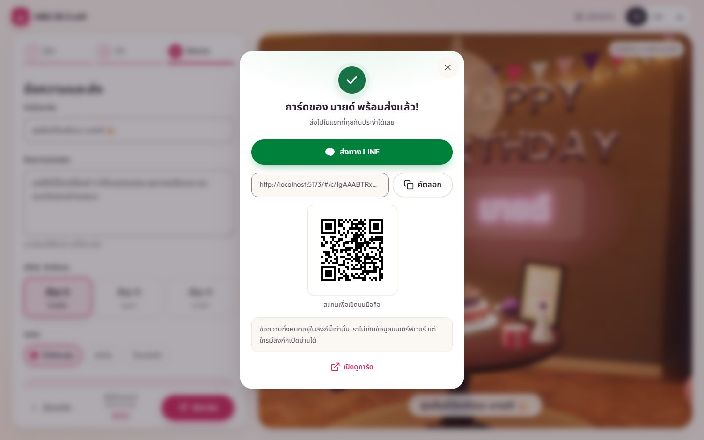<br><b>3. ส่งลิงก์</b> ส่งผ่าน LINE, เมนูแชร์ของเครื่อง, คัดลอกลิงก์ หรือสแกน QR บนเดสก์ท็อป<br><sub>Share: LINE first, the native share menu, copy, or a QR code on desktop.</sub></td>
    <td valign="top">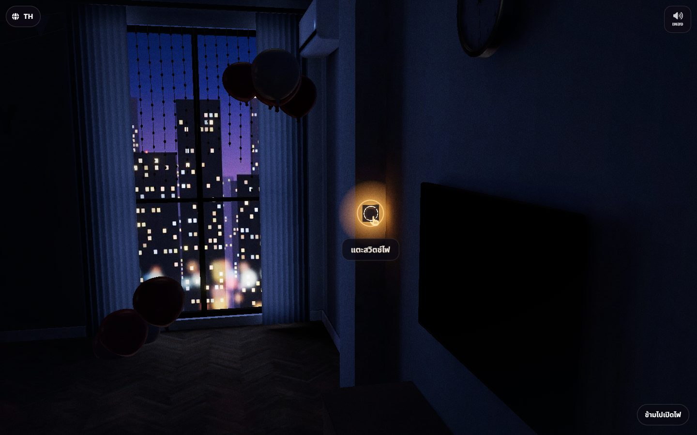<br><b>5. ห้องมืด</b> ตาค่อย ๆ ปรับกับความมืด เห็นแสงเมืองจากหน้าต่างและสวิตช์ที่เรืองแสง<br><sub>The dark room: eyes adapt, the city glows through the window, the switch waits.</sub></td>
  </tr>
  <tr>
    <td valign="top">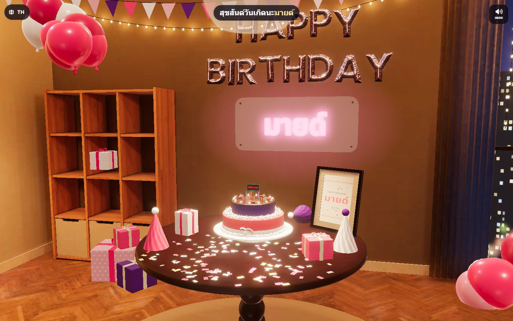<br><b>6. เปิดไฟ เซอร์ไพรส์!</b> ไฟติดทั้งห้อง เสียงเฮ พลุกระดาษ แล้วกล้องเคลื่อนไปที่โต๊ะ<br><sub>Lights on: the room cheers, poppers fire, the camera glides to the table.</sub></td>
    <td valign="top">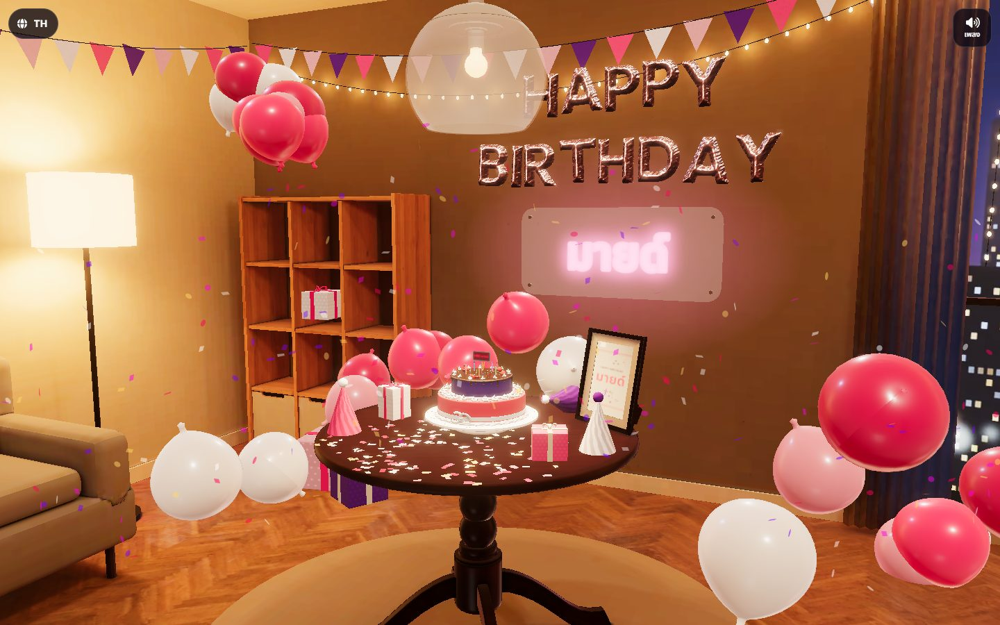<br><b>8. ตอนจบ</b> เป่าเทียนครบ ไฟสว่างกลับ ลูกโป่งร่วง คอนเฟตตีฟุ้ง<br><sub>Finale: the last candle goes out, lights snap back, balloons fall.</sub></td>
  </tr>
</table>

<table>
  <tr>
    <td width="25%" valign="top">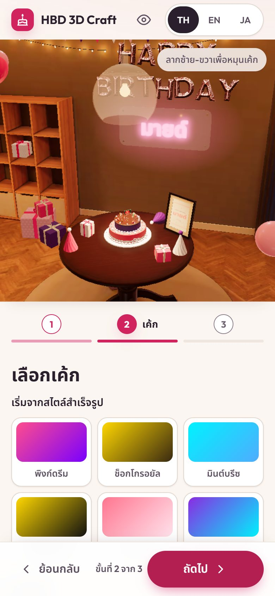<br><sub>หน้าสร้างการ์ดบนมือถือ<br>Creator on a phone</sub></td>
    <td width="25%" valign="top">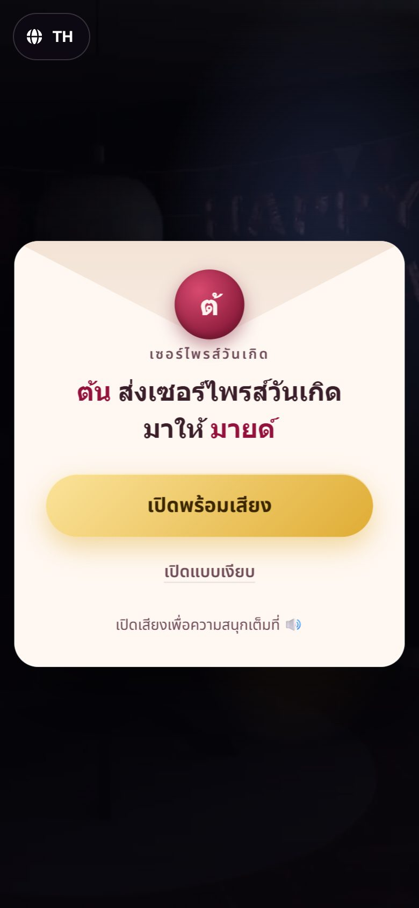<br><sub><b>4.</b> ซองจดหมายบอกว่าใครส่งถึงใคร<br>The envelope names sender and recipient</sub></td>
    <td width="25%" valign="top">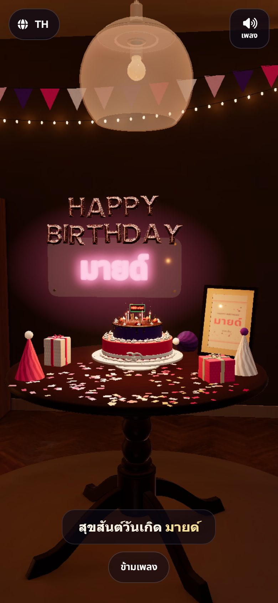<br><sub><b>7.</b> ปิดไฟ จุดเทียน ร้องเพลงแบบไทย<br>Lights down, candles, the song</sub></td>
    <td width="25%" valign="top">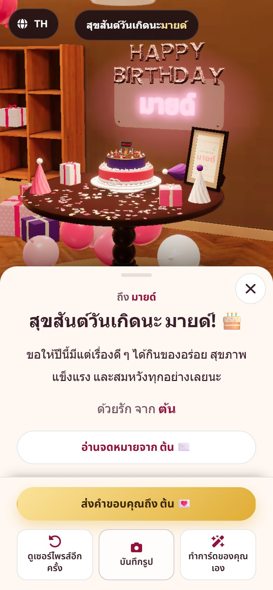<br><sub><b>9.</b> ข้อความอวยพรและปุ่มตอนจบ<br>The message and end actions</sub></td>
  </tr>
</table>

---

<a id="th"></a>

# ภาษาไทย

## สารบัญ

1. [HBD 3D Craft คืออะไร](#th-what)
2. [ลำดับประสบการณ์](#th-flow)
3. [ความสามารถ](#th-features)
4. [เริ่มใช้งานบนเครื่อง](#th-start)
5. [คำสั่ง npm](#th-scripts)
6. [โครงสร้างโปรเจกต์](#th-structure)
7. [เบราว์เซอร์ที่รองรับ](#th-browsers)
8. [ความเป็นส่วนตัว](#th-privacy)
9. [เครดิตและสัญญาอนุญาต](#th-credits)
10. [ข้อจำกัดที่ทราบและแผนงาน](#th-roadmap)
11. [อภิธานศัพท์](#glossary)

<a id="th-what"></a>

## HBD 3D Craft คืออะไร

เว็บแอปหน้าเดียวสำหรับสร้างการ์ดวันเกิด 3 มิติแล้วส่งเป็นลิงก์ ทุกอย่างที่การ์ดต้องใช้ (ชื่อ ข้อความ เค้ก ฉาก) ถูกบีบอัดอยู่ใน [แฮชของลิงก์](#glossary "Hash / fragment: ส่วนหลังเครื่องหมาย # ของ URL ซึ่งเบราว์เซอร์ไม่ส่งไปที่เซิร์ฟเวอร์") จึงไม่มีฐานข้อมูลและไม่มีเซิร์ฟเวอร์หลังบ้าน โฮสต์เป็นไฟล์ static ได้ทุกที่

ฉากเริ่มต้นของการ์ดใหม่คือ **ห้องเซอร์ไพรส์** ห้องนั่งเล่นคอนโดตอนกลางคืนที่จัดแสงไว้ล่วงหน้าด้วย Blender ([เบค](#glossary "Bake: คำนวณแสงล่วงหน้าแล้วเก็บเป็นภาพ")) ผู้รับเข้าห้องมืด แตะสวิตช์ ไฟเปิด แล้วเพื่อน ๆ ก็เซอร์ไพรส์ ฉากสตูดิโอแบบเดิมอีก 6 แบบยังเลือกได้ และลิงก์เก่าทุกลิงก์เปิดได้เหมือนเดิม

<a id="th-flow"></a>

## ลำดับประสบการณ์

**ฝั่งผู้สร้าง (3 ขั้น)**

| ขั้น | สิ่งที่ทำ |
|---|---|
| 1. ส่งให้ใคร | ชื่อผู้รับ (บังคับ), ชื่อผู้ส่ง, วันเกิด, ความสัมพันธ์ (เพื่อน คนรัก ครอบครัว เพื่อนร่วมงาน) ถ้าวันเกิดผ่านมาแล้วไม่เกิน 45 วัน ข้อความจะเป็นแบบอวยพรย้อนหลัง |
| 2. เลือกเค้ก | ลุคสำเร็จรูป 6 แบบ, ทรงเค้ก 5 แบบ, โทนสี 9 แบบ, ฉาก 7 แบบ, ท็อปเปอร์, จำนวนเทียนและท็อปปิ้ง, ครีม, จาน, สีกำหนดเอง |
| 3. ข้อความและส่ง | หัวข้อ, ข้อความ, จดหมายในซอง (เปิดปิดได้), ลายมือ 3 แบบ, เพลง 3 โทน, ซอง 4 แบบ, ลิงก์รูป (ไม่บังคับ), ดูตัวอย่างแบบผู้รับ แล้วกดสร้างลิงก์ |

ร่างการ์ดบันทึกอัตโนมัติในเบราว์เซอร์ของผู้สร้าง ปิดหน้าไปแล้วกลับมาทำต่อได้

**ฝั่งผู้รับ (ห้องเซอร์ไพรส์)**

```mermaid
flowchart LR
    A[ซองจดหมาย<br>เปิด หรือ เปิดแบบเงียบ] --> B[ห้องมืด<br>ตาปรับแสง คำใบ้ใน 1.1 วิ]
    B -->|แตะสวิตช์ หรืออัตโนมัติที่ 9 วิ| C[เปิดไฟ<br>เซอร์ไพรส์! พลุ คอนเฟตตี]
    C --> D[กล้องเคลื่อนไปที่โต๊ะ]
    D --> E[ปิดไฟ จุดเทียน<br>ร้องเพลงพร้อมเนื้อร้อง]
    E --> F[อธิษฐาน]
    F --> G[เป่าเทียน<br>แตะ หรือใช้ไมค์]
    G --> H[ไฟสว่าง ลูกโป่งร่วง]
    H --> I[การ์ดข้อความ<br>ขอบคุณ ดูอีกครั้ง บันทึกรูป]
```

ฉากสตูดิโอแบบอื่นใช้ลำดับสั้นกว่า: ซองจดหมาย, กล้องเคลื่อนเข้าหาเค้กและจุดเทียน, อธิษฐาน, เป่าเทียน, ฉลอง, การ์ดข้อความ

<a id="th-features"></a>

## ความสามารถ

<p align="center">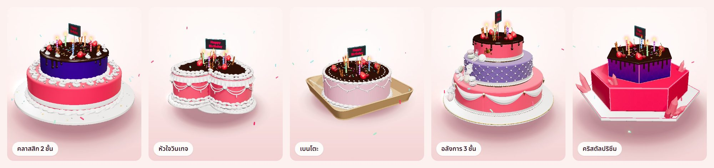</p>

| ด้าน | รายละเอียด |
|---|---|
| เค้ก 3 มิติ | 5 ทรง สร้างด้วยโค้ดทั้งหมด (ไม่มีไฟล์โมเดล): คลาสสิก 2 ชั้น, หัวใจวินเทจ, เบนโตะ, อลังการ 3 ชั้น, คริสตัลปริซึม เปลวเทียนเรืองแสงจริง |
| ห้องเซอร์ไพรส์ | เฟอร์นิเจอร์ CC0 จาก Poly Haven, แสงเบคด้วย Cycles 2 ชุด (มืด และ ไฟปาร์ตี้), ลูกโป่งฟอยล์ HAPPY BIRTHDAY, ป้ายไฟชื่อผู้รับ (ตัวอักษรไทยถูกต้อง), ลูกโป่ง ไฟประดับ ธงราว ของขวัญ หมวก คอนเฟตตี 3 มิติ สีทั้งหมดตามโทนการ์ด รูปของการ์ดอยู่ในกรอบบนโต๊ะ |
| ฉากอื่น | กลางคืน (ฉากเดิม) และฉากสตูดิโอสีอ่อน 5 แบบ: ชมพูพาสเทล ครีม ฟ้าใส มิ้นต์ ลาเวนเดอร์ |
| เป่าเทียน | แตะที่เปลวไฟหรือที่เค้ก (เป้าแตะอย่างน้อย 44 px) กด Space/Enter ได้ ไมโครโฟนเป็นตัวเลือกและขออนุญาตก่อนเสมอ |
| เสียง | สังเคราะห์ทั้งหมดด้วย Web Audio: เพลงแฮปปี้เบิร์ธเดย์ (ทำนองสาธารณสมบัติ) เสียงสวิตช์ พลุ เสียงห้อง เสียงเชียร์แบบไม่มีคำ มีลิมิตเตอร์กันเสียงดังกะทันหัน เพิ่มเสียงคนจริงได้ภายหลัง ([public/audio/README.md](public/audio/README.md)) |
| ตอนจบ | ขอบคุณผู้ส่งผ่าน LINE, ดูเซอร์ไพรส์อีกครั้ง, บันทึกรูป 1080x1350 หรือ 1600x1200, สร้างการ์ดของตัวเอง |
| ลิงก์สั้น | การ์ดทั่วไปมีแฮชยาวประมาณ 30 ตัวอักษร (เช่น `#/c/IgAAABTRxhsFobKilMwCA5XJmQ`) ลิงก์ทุกรุ่นก่อนหน้ายังเปิดได้ |
| รองรับเครื่องช้า | แบ่ง [ระดับเครื่อง](#glossary "Tier: ระดับเครื่อง 0 มือถือรุ่นเล็ก 1 มือถือ 2 เดสก์ท็อป") ตามชนิดอุปกรณ์ CPU และหน่วยความจำ, [ตัวคุมคุณภาพ](#glossary "Governor: ลดความละเอียด ปิด bloom ตามเฟรมเรตจริง") ลดคุณภาพเมื่อเฟรมตก, [โหมดภาพนิ่ง 2 มิติ](#glossary "Poster mode: ใช้ภาพเรนเดอร์ของห้องแทน 3 มิติ") เมื่อเครื่องวาดไม่ทันหรือเปิดก่อนห้องโหลดเสร็จ |
| การเข้าถึง | รองรับ reduced motion (ตัดภาพแทนการเคลื่อนกล้อง), โหมดเงียบ, ปุ่ม Esc ปิดหน้าต่าง, ประกาศสำหรับโปรแกรมอ่านหน้าจอ |
| ภาษา | ไทย อังกฤษ ญี่ปุ่น (ข้อความครบทั้ง 3 ภาษา) ข้อความตั้งต้นของการ์ดเป็นภาษาของผู้สร้าง |

<p align="center">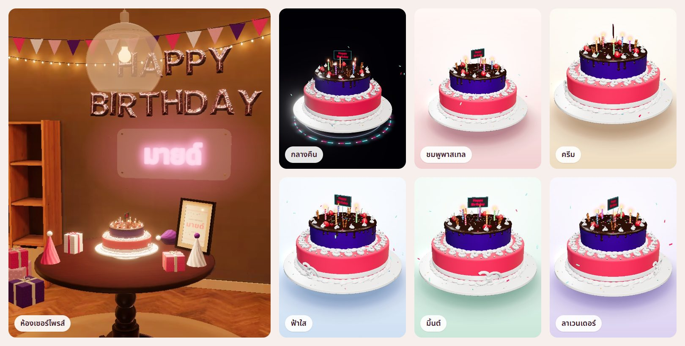</p>

<a id="th-start"></a>

## เริ่มใช้งานบนเครื่อง

ต้องมี Node.js 20 LTS (CI ใช้ 20; Vite 5 ต้องการ 18 ขึ้นไป) และ npm

```bash
git clone https://github.com/Gubbitkeytoday/hbd-3d-craft.git
cd hbd-3d-craft
npm ci
npm run dev
```

เปิด http://localhost:5173 สร้างการ์ด แล้วกดลิงก์ "เปิดดูการ์ด" ในหน้าต่างแชร์เพื่อดูแบบผู้รับ หน้าทดสอบห้องสำหรับนักพัฒนาอยู่ที่ `/src/room/dev/room-test.html` (เฉพาะโหมด dev)

ไมโครโฟนทำงานเฉพาะบน `https` หรือ `localhost` ทดสอบบนมือถือจริงผ่าน `npm run dev -- --host` แล้วเปิดด้วย IP ของเครื่อง (ไมค์จะใช้ไม่ได้บน http ธรรมดา ส่วนอื่นใช้ได้)

<a id="th-scripts"></a>

## คำสั่ง npm

| คำสั่ง | ทำอะไร |
|---|---|
| `npm run dev` | เซิร์ฟเวอร์พัฒนา Vite ที่พอร์ต 5173 |
| `npm run build` | ตรวจ ESLint แล้ว build ไป `dist/` (lint มี error = build ล้ม) |
| `npm run preview` | เสิร์ฟ `dist/` เพื่อทดสอบแบบ production |
| `npm run lint` | ตรวจโค้ดด้วย ESLint |
| `npm run icons` | สร้าง `src/styles/icons.css` ใหม่จากไอคอน `fa-*` ที่ใช้จริง (Vite ทำให้อัตโนมัติอยู่แล้ว) |
| `npm run screenshots` | ถ่ายภาพหน้าจอทั้งชุดใน `screenshots/` จากเซิร์ฟเวอร์ที่รันอยู่ (ดู [CONTRIBUTING.md](CONTRIBUTING.md#screenshots)) |
| `npm run room:fetch` | ดาวน์โหลดโมเดล CC0 จาก Poly Haven และวาดภาพเมืองกลางคืน (ต้องมี Python และ Pillow) |
| `npm run room:optimize` | แปลงไฟล์จาก Blender เป็นไฟล์เว็บใน `public/room/` และเขียน CREDITS.md |

ขั้นตอนสร้างห้องใหม่ด้วย Blender อยู่ใน [DEPLOYMENT.md](DEPLOYMENT.md#rebuild-room)

<a id="th-structure"></a>

## โครงสร้างโปรเจกต์

```text
index.html                 หน้าเดียวของแอป (ผู้สร้าง + ผู้รับ)
src/
  main.js                  เราเตอร์ตามแฮช + ตัวกรองข้อมูลจากลิงก์ (sanitizer)
  card-link.js             เข้ารหัส/ถอดรหัสลิงก์ (v2.1, v2, v1, legacy)
  card-templates.js        ข้อความตั้งต้น 3 ภาษา
  creator.js               หน้าสร้างการ์ด 3 ขั้น, แชร์, ร่างอัตโนมัติ
  creator-scene.js         พรีวิว 3 มิติของผู้สร้าง
  viewer.js                ประสบการณ์ผู้รับทั้งหมด (ลำดับฉาก, เป่าเทียน, ตอนจบ)
  cake-models.js, cake/    ชุดประกอบเค้ก, เทียน, โมเดลละไฟล์
  backdrops.js             ฉากกลางคืนและสตูดิโอสีอ่อน
  room/                    ห้องเซอร์ไพรส์ (โหลด, วัสดุแสงเบค, ไฟ, ของตกแต่ง)
  audio/                   เอนจินเสียง, เพลง, เสียงประกอบ
  render-quality.js        ระดับเครื่อง, tone mapping, bloom, ตัวคุมคุณภาพ
  i18n.js, fonts.js        ข้อความ 3 ภาษา, โหลดฟอนต์ตามต้องใช้
  styles/                  CSS แยกส่วนผู้สร้าง ผู้รับ ไอคอน ฟอนต์
public/
  room/                    ไฟล์ห้องที่ผ่านการบีบอัดแล้ว + CREDITS.md
  audio/                   ช่องใส่เสียงคนจริง (ยังว่าง) + README
scripts/
  gen-icons.mjs            สร้าง icons.css
  screenshots.mjs          ถ่ายภาพหน้าจอทั้งชุด
  room/                    ท่อสร้างห้อง: ดาวน์โหลด, Blender, บีบอัด, เครดิต
screenshots/               ภาพในเอกสารนี้
```

รายละเอียดการทำงานภายในอยู่ใน [ARCHITECTURE.md](ARCHITECTURE.md)

<a id="th-browsers"></a>

## เบราว์เซอร์ที่รองรับ

| เบราว์เซอร์ | สถานะ |
|---|---|
| Chrome / Edge 105+ (เดสก์ท็อปและ Android) | รองรับเต็ม |
| Safari / iOS 16.4+ | รองรับเต็ม |
| Firefox 121+ | รองรับ |
| เบราว์เซอร์ในแอป LINE (iOS, Android) | รองรับ ยกเว้นไมโครโฟน (มีปุ่มให้เปิดในเบราว์เซอร์แทน) |
| ไม่มี WebGL | ยังเห็นข้อความอวยพรและการ์ด แต่ไม่มีฉาก 3 มิติ |

เลขเวอร์ชันข้างบนมาจากฟีเจอร์ที่โค้ดใช้ (CSS `:has()`, `DecompressionStream`, `BigInt`) ไม่ใช่ผลทดสอบบนเครื่องจริงทุกรุ่น เบราว์เซอร์เก่ากว่านี้อาจเปิดได้แต่หน้าตาหรือบางฟีเจอร์ลดลง

<a id="th-privacy"></a>

## ความเป็นส่วนตัว

- **ข้อมูลทั้งหมดอยู่ในลิงก์** ชื่อ ข้อความ และการตั้งค่าอยู่ในแฮชของ URL ซึ่งเบราว์เซอร์ไม่ส่งไปที่เซิร์ฟเวอร์ ไม่มีฐานข้อมูล ไม่มีบัญชีผู้ใช้ ไม่มีระบบเก็บสถิติ ไม่มีคุกกี้
- ใครก็ตามที่ได้ลิงก์จะอ่านการ์ดได้ ให้ถือว่าลิงก์คือตัวการ์ด
- ข้อมูลที่เก็บในเครื่อง: ร่างการ์ดและภาษาที่เลือก (localStorage ของผู้สร้าง) และตำแหน่งตอนจบชั่วคราวเมื่อกดขอบคุณใน LINE (sessionStorage ของผู้รับ)
- ไมโครโฟนเปิดเมื่อผู้รับยินยอมเท่านั้น เสียงถูกวิเคราะห์ในหน่วยความจำ ไม่บันทึกและไม่ส่งไปไหน
- ถ้าผู้สร้างใส่ลิงก์รูป เบราว์เซอร์ของผู้รับจะโหลดรูปจากเว็บนั้นโดยตรง (ไม่ส่ง referrer) เว็บเจ้าของรูปจึงเห็นการเข้าถึงนั้น
- รายละเอียดด้านความปลอดภัยอยู่ใน [SECURITY.md](SECURITY.md)

<a id="th-credits"></a>

## เครดิตและสัญญาอนุญาต

- โค้ดของโปรเจกต์: [MIT](LICENSE)
- เฟอร์นิเจอร์และพื้นผิวในห้อง: CC0 1.0 จาก [Poly Haven](https://polyhaven.com/license) รายชื่อไฟล์และผู้สร้างครบใน [public/room/CREDITS.md](public/room/CREDITS.md) ส่วนโครงห้อง โซฟา ทีวี แอร์ และภาพเมืองกลางคืนสร้างด้วยสคริปต์ของโปรเจกต์
- ไลบรารี: three.js (MIT), anime.js (MIT), canvas-confetti (ISC), meshoptimizer decoder (MIT, สำเนาใน `public/room/vendor/`), ตัวสร้าง QR เขียนตามแบบของ Project Nayuki (MIT)
- ฟอนต์ (SIL OFL 1.1 ผ่าน @fontsource): Outfit, Noto Sans Thai, Noto Serif Thai, Playfair Display, Great Vibes, Mali ไอคอนจาก Font Awesome Free (ไอคอน CC BY 4.0, โค้ด MIT)
- เพลง Happy Birthday to You: ทำนองเป็นสาธารณสมบัติ สังเคราะห์ในเบราว์เซอร์

<a id="th-roadmap"></a>

## ข้อจำกัดที่ทราบและแผนงาน

| เรื่อง | สถานะตอนนี้ | ขั้นต่อไป | ผู้รับผิดชอบ |
|---|---|---|---|
| อัปโหลดรูป | ยังไม่มี ใส่ได้เฉพาะลิงก์รูป https | ต้องมีที่เก็บไฟล์ ซึ่งขัดกับหลัก "ไม่มีเซิร์ฟเวอร์" ต้องตัดสินใจก่อน | PM, RD/Tech Lead |
| มือถือ Android ระดับกลาง | ทดสอบแบบจำลอง (CPU ช้าลง 6 เท่า) ได้ราว 26 ถึง 30 fps หลังเปิดไฟ ต่ำกว่าเป้า 30 fps เล็กน้อย | วัดบนเครื่องจริง แล้วปรับงบ draw call หรือเข้าโหมด 2 มิติเร็วขึ้น | RD/Tech Lead, QA |
| ทดสอบบนเครื่องจริง | ทุกตัวเลขมาจาก Chromium จำลองบน Windows ยังไม่ได้ทดสอบ iPhone และ Android จริง | ชุดทดสอบ iPhone SE, iPhone รุ่นใหม่, Android กลางและล่าง, ในแอป LINE | QA |
| เว็บจริง | ขึ้นแล้วที่ https://gubbitkeytoday.github.io/hbd-3d-craft/ (GitHub Pages, deploy อัตโนมัติเมื่อ push ขึ้น `main`) | ทดสอบลิงก์ใน LINE บนมือถือจริง | IT |
| เสียงคนจริง | ยังไม่มี ใช้เสียงเชียร์แบบไม่มีคำ | อัดเสียง "เซอร์ไพรส์!" และเสียงเชียร์ตาม [public/audio/README.md](public/audio/README.md) | PD, MKT/BD |
| ชุดทดสอบอัตโนมัติ | มี lint และ build ใน CI เท่านั้น | เพิ่มทดสอบ codec ลิงก์และทดสอบผ่านเบราว์เซอร์ | RD/Tech Lead, QA |

---

<a id="en"></a>

# English

## Contents

1. [What it is](#en-what)
2. [The flow](#en-flow)
3. [Features](#en-features)
4. [Quick start](#en-start)
5. [npm scripts](#en-scripts)
6. [Project structure](#en-structure)
7. [Browser support](#en-browsers)
8. [Privacy](#en-privacy)
9. [Credits and licences](#en-credits)
10. [Known limits and roadmap](#en-roadmap)
11. [Glossary](#glossary)

<a id="en-what"></a>

## What it is

A single-page web app for making a 3D birthday card and sending it as a link. Everything the card needs (names, message, cake, backdrop) is packed into the [URL fragment](#glossary "The part after #, which browsers never send to the server"), so there is no database and no backend: any static host will do.

New cards default to the **surprise room**, a Bangkok condo living room at night with light [baked](#glossary "Light computed ahead of time and stored in textures") in Blender. The recipient enters in the dark, taps the light switch, and the room shouts surprise. The six earlier studio backdrops remain available, and every link ever made still opens.

<a id="en-flow"></a>

## The flow

**Creator (3 steps)**

| Step | What happens |
|---|---|
| 1. Who's it for? | Recipient name (required), sender, birthday, relation (friend, partner, family, colleague). A birthday up to 45 days ago switches the wording to belated. |
| 2. Pick the cake | 6 one-tap looks, 5 cake shapes, 9 moods, 7 backdrops, topper, candle and topping counts, frosting, plate, custom colours. |
| 3. Message and send | Title, message, optional sealed letter, 3 handwriting styles, 3 music timbres, 4 envelopes, optional photo link, recipient preview, then the share sheet. |

The draft autosaves in the creator's browser.

**Recipient (surprise room)**

```mermaid
flowchart LR
    A[Envelope<br>Open or Open quietly] --> B[Dark room<br>eyes adapt, hint at 1.1 s]
    B -->|tap the switch, or auto at 9 s| C[Lights on<br>SURPRISE, poppers, confetti]
    C --> D[Camera glides to the table]
    D --> E[Lights down, candles lit<br>the song with lyrics]
    E --> F[Make a wish]
    F --> G[Blow out the candles<br>tap, or opt-in mic]
    G --> H[Lights back, balloon drop]
    H --> I[Message card<br>thank, replay, save photo]
```

The studio backdrops use the shorter classic flow: envelope, establishing move and candles, wish, blow, celebration, message.

<a id="en-features"></a>

## Features

| Area | Details |
|---|---|
| 3D cakes | Five procedurally built models (no model files): classic 2-tier, vintage heart, Korean bento, grand 3-tier, crystal prism. Additive, blooming candle flames. |
| Surprise room | CC0 Poly Haven furniture, two Cycles lightmap sets (dark, party), foil HAPPY BIRTHDAY balloons, an LED name sign with correct Thai shaping, balloons, fairy lights, bunting, gifts, hats and 3D confetti, all in the card's palette; the card photo stands in a frame on the table. |
| Other backdrops | Night (the original stage) and five pale studio sweeps: blush, cream, sky, mint, lavender. |
| Blowing candles | Tap a flame or the cake (targets at least 44 px), or Space / Enter. The microphone is opt-in behind an explainer. |
| Sound | All synthesized with Web Audio: Happy Birthday (public-domain melody), switch click, poppers, room tone, wordless crowd, through a limiter so nothing is ever startlingly loud. Real voice clips can be dropped in later ([public/audio/README.md](public/audio/README.md)). |
| End actions | Thank the sender on LINE, watch the surprise again, save a 1080x1350 or 1600x1200 photo, make your own card. |
| Short links | A typical card's fragment is about 30 characters (`#/c/IgAAABTRxhsFobKilMwCA5XJmQ`). All earlier link formats still decode. |
| Weak devices | Device [tiers](#glossary "0 low-end phone, 1 phone, 2 desktop") from device type, cores and memory; an FPS [governor](#glossary "Steps pixel ratio, bloom and shadows down when frames drop"); a 2D [poster mode](#glossary "Baked stills of the room instead of live 3D") when the phone cannot draw the room or the recipient opens before it has loaded. |
| Accessibility | Reduced motion (cuts instead of camera glides), quiet mode, Escape closes dialogs, screen-reader announcements. |
| Languages | Thai, English, Japanese with identical key sets; starter wording follows the sender's language. |

<a id="en-start"></a>

## Quick start

Requires Node.js 20 LTS (CI uses 20; Vite 5 needs 18 or newer) and npm.

```bash
git clone https://github.com/Gubbitkeytoday/hbd-3d-craft.git
cd hbd-3d-craft
npm ci
npm run dev
```

Open http://localhost:5173, make a card, then use "Open card" in the share sheet to see it as the recipient. A developer harness for the room lives at `/src/room/dev/room-test.html` (dev server only).

The microphone needs `https` or `localhost`. To try a real phone, run `npm run dev -- --host` and open the machine's IP (everything but the mic works over plain http).

<a id="en-scripts"></a>

## npm scripts

| Script | What it does |
|---|---|
| `npm run dev` | Vite dev server on port 5173 |
| `npm run build` | ESLint, then a production build into `dist/` (a lint error fails the build) |
| `npm run preview` | Serves `dist/` for a production check |
| `npm run lint` | ESLint only |
| `npm run icons` | Regenerates `src/styles/icons.css` from the `fa-*` classes in use (Vite also does this on start, edit and build) |
| `npm run screenshots` | Regenerates every image in `screenshots/` from a running server (see [CONTRIBUTING.md](CONTRIBUTING.md#screenshots)) |
| `npm run room:fetch` | Downloads the CC0 Poly Haven assets and paints the night-city image (needs Python with Pillow) |
| `npm run room:optimize` | Turns the Blender export into web assets in `public/room/` and writes CREDITS.md |

Rebuilding the room with Blender is described in [DEPLOYMENT.md](DEPLOYMENT.md#rebuild-room).

<a id="en-structure"></a>

## Project structure

```text
index.html                 the single page (creator + receiver markup)
src/
  main.js                  hash router + share-link sanitizer
  card-link.js             link codec (v2.1, v2, v1, legacy)
  card-templates.js        starter wording in three languages
  creator.js               3-step creator, share sheet, draft autosave
  creator-scene.js         the creator's live 3D preview
  viewer.js                the recipient experience (beats, candles, end actions)
  cake-models.js, cake/    cake kit, candles, one file per model
  backdrops.js             night and pale studio backdrops
  room/                    surprise room (loader, baked materials, rig, party props)
  audio/                   audio engine, song, cues
  render-quality.js        device tiers, tone mapping, bloom, FPS governor
  i18n.js, fonts.js        translations, on-demand card fonts
  styles/                  creator, receiver, icon and font stylesheets
public/
  room/                    optimized room assets + CREDITS.md
  audio/                   slot for real voice clips (empty) + README
scripts/
  gen-icons.mjs            icons.css generator
  screenshots.mjs          documentation screenshots
  room/                    room pipeline: fetch, Blender, optimize, credits
screenshots/               images used in these docs
```

How it all works is in [ARCHITECTURE.md](ARCHITECTURE.md).

<a id="en-browsers"></a>

## Browser support

| Browser | Status |
|---|---|
| Chrome / Edge 105+ (desktop and Android) | Full |
| Safari / iOS 16.4+ | Full |
| Firefox 121+ | Supported |
| LINE in-app browser (iOS, Android) | Supported except the microphone (an "open in browser" button replaces it) |
| No WebGL | The greeting and message card still show, without the 3D scene |

These versions follow from features the code relies on (CSS `:has()`, `DecompressionStream`, `BigInt`), not from a device lab. Older browsers may open cards with reduced styling or features.

<a id="en-privacy"></a>

## Privacy

- **All card data lives in the link.** Names, message and settings sit in the URL fragment, which browsers never send to a server. No database, no accounts, no analytics, no cookies.
- Anyone who has the link can read the card: treat the link as the card.
- Stored locally: the creator's draft and language (localStorage on the sender's device) and a short-lived end-screen marker when the recipient thanks the sender from LINE (sessionStorage).
- The microphone opens only after the recipient agrees; audio is analysed in memory, never recorded or sent.
- A photo link makes the recipient's browser fetch that image from its host (without a referrer), so that host sees the request.
- Security details: [SECURITY.md](SECURITY.md).

<a id="en-credits"></a>

## Credits and licences

- Project code: [MIT](LICENSE).
- Room furniture and surfaces: CC0 1.0 from [Poly Haven](https://polyhaven.com/license); every file and author is listed in [public/room/CREDITS.md](public/room/CREDITS.md). The room shell, sofa, TV, AC unit and night-city image are generated by the project's scripts.
- Libraries: three.js (MIT), anime.js (MIT), canvas-confetti (ISC), meshoptimizer decoder (MIT, copy in `public/room/vendor/`), a QR encoder written after Project Nayuki's reference (MIT).
- Fonts (SIL OFL 1.1 via @fontsource): Outfit, Noto Sans Thai, Noto Serif Thai, Playfair Display, Great Vibes, Mali. Icons from Font Awesome Free (icons CC BY 4.0, code MIT).
- Happy Birthday to You: public-domain melody, synthesized in the browser.

<a id="en-roadmap"></a>

## Known limits and roadmap

| Topic | Today | Next | Owner |
|---|---|---|---|
| Photo upload | Not available; only an https image link | Needs file storage, which breaks the no-backend model: decide first | PM, RD/Tech Lead |
| Mid-range Android | Emulated (6x CPU throttle): about 26 to 30 fps after the reveal, just under the 30 fps goal | Measure on real devices, then trim draw calls or enter poster mode sooner | RD/Tech Lead, QA |
| Real-device checks | Every number comes from emulated Chromium on Windows; no real iPhone or Android run yet | Device pass: iPhone SE, a current iPhone, mid and low Android, inside LINE | QA |
| Live site | Live at https://gubbitkeytoday.github.io/hbd-3d-craft/ (GitHub Pages, auto-deployed on every push to `main`) | Test links inside LINE on real phones | IT |
| Real voices | None yet; the crowd is wordless | Record "เซอร์ไพรส์!" and the cheer per [public/audio/README.md](public/audio/README.md) | PD, MKT/BD |
| Automated tests | Lint and build in CI only | Link-codec unit tests and a browser smoke test | RD/Tech Lead, QA |

---

<a id="glossary"></a>

## อภิธานศัพท์ / Glossary

| คำ / Term | ภาษาไทย | English |
|---|---|---|
| Fragment / hash | ส่วนหลัง `#` ของลิงก์ เบราว์เซอร์ไม่ส่งไปที่เซิร์ฟเวอร์ | The part of a URL after `#`; never sent to the server |
| Bake / lightmap | คำนวณแสงล่วงหน้าใน Blender แล้วเก็บเป็นภาพ (ไลต์แมป) | Light computed ahead of time in Blender and stored as textures |
| Draw call | คำสั่งวาด 1 ครั้งต่อวัตถุ ยิ่งมากยิ่งหนักสำหรับมือถือ | One GPU draw command; the main cost on phones |
| Shader recompile | การคอมไพล์โปรแกรมกราฟิกใหม่ ทำให้ภาพกระตุก โปรเจกต์นี้ออกแบบไม่ให้เกิดตอนเปิดไฟ | Rebuilding a GPU program; causes a stutter. The reveal is designed to need none |
| Tier | ระดับเครื่อง: 0 มือถือรุ่นเล็ก, 1 มือถือ, 2 เดสก์ท็อป | Device class: 0 low-end phone, 1 phone, 2 desktop |
| Governor | ตัวคุมคุณภาพที่ลดความละเอียด ปิด bloom และลดเงาเมื่อเฟรมตก | Steps pixel ratio, bloom and shadows down when frames drop |
| Poster mode | โหมด 2 มิติที่ใช้ภาพนิ่งเรนเดอร์ของห้องแทน 3 มิติ | 2D show on baked stills of the room instead of live 3D |
| Greybox | ห้องรูปทรงง่ายที่แสดงระหว่างรอไฟล์ห้องจริง | Simple stand-in room shown while the baked room streams in |
| Eye adaptation | ภาพค่อย ๆ สว่างขึ้นในห้องมืดเหมือนตาปรับแสง | Exposure that rises slowly in the dark, like eyes adjusting |
| Quiet mode | เปิดการ์ดแบบไม่มีเสียง แตะลำโพงเพื่อเปิดเสียงทีหลัง | Opens the card silently; tap the speaker to fade sound in |
| Reduced motion | ตั้งค่าระบบให้ลดการเคลื่อนไหว แอปจะตัดภาพแทนการเคลื่อนกล้อง | OS setting; the app cuts between shots instead of moving the camera |
| CC0 | สัญญาอนุญาตสาธารณสมบัติ ใช้ได้โดยไม่ต้องให้เครดิต | Public-domain dedication; free use without attribution |
| meshopt | รูปแบบบีบอัดโมเดล 3 มิติที่ถอดรหัสเร็วในเบราว์เซอร์ | A fast-decoding compression for 3D meshes |
| PMREM / env map | ภาพสะท้อนของห้องที่เตรียมไว้ให้วัตถุมันวาวสะท้อน | Prefiltered room reflections for glossy materials |
| Sanitizer | ตัวกรองที่บังคับข้อมูลจากลิงก์ให้อยู่ในรูปที่ผู้สร้างทำได้เท่านั้น | Forces link data back into the shape the creator can produce |
| LINE in-app browser | เบราว์เซอร์ที่เปิดเมื่อกดลิงก์ในแชต LINE | The browser LINE opens when a link is tapped in a chat |

<p align="right"><a href="#top">กลับด้านบน / Back to top</a></p>
