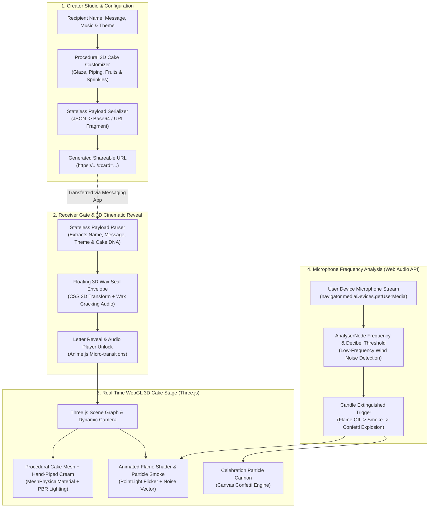

# 🎂 HBD 3D Craft — Interactive 3D Birthday Card Creator

<div align="center">

[](https://threejs.org/)
[](https://vitejs.dev/)
[](#-microphone-candle-blowing-engine)
[](#-stateless-url-payload-engine)
[](src/i18n.js)
[](LICENSE)

**Design stunning, cinematic 3D birthday cards online — complete with interactive hand-piped-cream cake customization, real microphone candle blowing, and zero-database shareable URLs.**

[Live Demo](https://hbd-3d-craft.pages.dev) • [Key Features](#-key-features) • [System Architecture](#-system-architecture) • [Visual Gallery](#-visual-gallery) • [Getting Started](#-getting-started--local-development) • [Engineering Specification](#-technical-specifications)

</div>

---

<p align="center">
  
</p>

---

## 📖 Executive Summary

**HBD 3D Craft** is an immersive WebGL interactive experience that elevates digital greetings into cinematic 3D memories. Built with **Three.js**, **Anime.js**, and modern **Web Audio API**, the platform empowers users to procedurally customize 3D celebration cakes, write personalized messages, choose from 9 glassmorphic color themes, and generate instantaneous shareable cards encoded directly into URL hash fragments.

When the recipient opens the link, a floating 3D wax-sealed envelope reveals their card, accompanied by ambient music, dynamic particle confetti, and a physics-driven candle that can be extinguished by blowing directly into their device's microphone.

---

## ⚡ Key Features & Engineering Highlights

| Feature | Technical Implementation | Highlights |
| :--- | :--- | :--- |
| **🎂 Procedural 3D Cake Builder** | Custom Three.js geometry extrusions, hand-piped cream beads, glossy toppings & fruit meshes | Real-time viewport rotation, customizable cake tiers, glazes & toppings |
| **🎤 Microphone Candle Blowing** | Web Audio API `AudioContext` with real-time `AnalyserNode` FFT frequency & amplitude analysis | Realistic extinguishing threshold, blow sound detection, falling smoke particles |
| **💌 Interactive 3D Envelope** | Pure CSS 3D matrix transform with wax seal breaking animation & opening envelope gate | Smooth multi-stage opening cinematic sequence driven by Anime.js |
| **🔗 Stateless URL Sharing** | Base64 / URI-encoded compressed payload containing all card parameters | **100% Serverless & Zero-Database:** shareable via LINE, Messenger, WhatsApp |
| **🎨 9 Glassmorphic Themes** | Dynamic HSL CSS token system (Neon Rose, Midnight Gold, Ocean Breeze, Sakura, etc.) | Real-time ambient background lighting & dynamic materials matching |
| **🎵 Curated Soundtracks** | HTML5 Audio engine with Lo-Fi, Romantic Piano, and Synth Pop background tracks | Smooth audio crossfading and mobile audio context unlock guard |
| **🌐 Multi-Language (i18n)** | Pure client-side dictionary switcher | English (EN), Thai (ภาษาไทย), and Japanese (日本語) |

---

## 🏗️ System Architecture



---

## 📸 Visual Gallery

| Creator Dashboard | Interactive Envelope Gate |
| :---: | :---: |
| [](screenshots/1_creator_dashboard.png)<br>**Creator Dashboard.** Customize cake tiers, toppings, message, and visual theme. | [](screenshots/2_envelope_gate.png)<br>**3D Wax Seal Envelope.** Floating letter gate that unfolds upon tap. |

| Receiver 3D Cake View | Discover & SEO Hub |
| :---: | :---: |
| [](screenshots/3_receiver_cake_view.png)<br>**3D Cake Reveal.** Animated candle flame, realistic lighting, and mic blow detection. | [](screenshots/4_discover_seo_hub.png)<br>**SEO Hub & Templates.** Curated template presets and design gallery. |

---

## 📂 Project Structure

```text
hbd-3d-craft/
├── .github/                      # GitHub Workflows & Automation
│   ├── workflows/ci.yml          # Automated Build & Lint Verification Pipeline
│   ├── ISSUE_TEMPLATE/           # Bug & Feature Request Templates
│   └── PULL_REQUEST_TEMPLATE.md  # Quality Checklist for Contributors
│
├── public/                       # Static Assets & Metadata
│   ├── audio/                    # Ambient BGM & SFX (Envelope crack, blow, fanfare)
│   ├── robots.txt                # Search Crawler Directives
│   └── sitemap.xml               # Static Sitemap
│
├── screenshots/                  # High-Resolution Application Screenshots
│   ├── 1_creator_dashboard.png   # Creator View UI
│   ├── 2_envelope_gate.png       # 3D Envelope Gate UI
│   ├── 3_receiver_cake_view.png  # Interactive 3D WebGL Cake UI
│   └── 4_discover_seo_hub.png    # SEO Discovery Page
│
├── src/                          # Application Source Code
│   ├── creator.js                # Creator Studio UI Controller & URL Serializer
│   ├── viewer.js                 # Three.js 3D Cake Generator, Particle & Mic Analyzer
│   ├── main.js                   # Application Routing & State Machine
│   ├── i18n.js                   # Internationalization (EN, TH, JA)
│   ├── render-quality.js         # Adaptive WebGL DPR & Resolution Scaler
│   └── style.css                 # Glassmorphic Design System & 9 HSL Themes
│
├── index.html                    # Single Page Application Root Shell
├── discover.html                 # Template Discovery Hub Page
├── vite.config.js                # Vite Build Configuration
└── package.json                  # Dependencies & Scripts
```

---

## 🛠️ Technical Specifications

| Subsystem | Specification | Technical Details |
| :--- | :--- | :--- |
| **3D Rendering** | Three.js `r160` | WebGL PBR `MeshPhysicalMaterial` with roughness, metalness, and clearcoat |
| **Candle Flame** | Vertex Displacement Shader | Procedural noise oscillation with synchronized fluctuating PointLight |
| **Microphone Analysis** | Web Audio API | `AnalyserNode` with FFT size 256 evaluating energy band between $100\,\text{Hz} - 800\,\text{Hz}$ |
| **Card Encoding** | Base64 URL Fragment | Encodes JSON payload into `window.location.hash` with URL-safe replacement |
| **Animation Pipeline** | Anime.js `v3.2` | Elastic easing for UI panels, letter unfolding, and camera orbit transitions |
| **Particle Physics** | Canvas Confetti | Multi-origin dual-cannon particle bursts with custom birthday color palettes |

---

## 💻 Getting Started & Local Development

### Prerequisites
- **Node.js** `>= 18.x`
- **npm** `>= 9.x`

### 1. Clone the Repository
```bash
git clone https://github.com/Gubbitkeytoday/hbd-3d-craft.git
cd hbd-3d-craft
```

### 2. Install Dependencies
```bash
npm install
```

### 3. Launch Development Server
```bash
npm run dev
```
Open **[http://localhost:5173](http://localhost:5173)** in your browser.

### 4. Build for Production
```bash
npm run build
npm run preview
```

---

## 🚢 Production Deployment

### Option 1: Cloudflare Pages (Recommended)
```bash
# Build production bundle
npm run build

# Deploy via Wrangler
npx wrangler pages deploy dist --project-name hbd-3d-craft
```

### Option 2: Vercel / Netlify
1. Connect repository to [Vercel](https://vercel.com) or [Netlify](https://netlify.com).
2. Set Build Command: `npm run build`
3. Set Output Directory: `dist`

---

## 🔒 Security & Privacy

- **100% Stateless & Client-Side:** No messages, names, or photos are transmitted to or stored on external servers.
- **Microphone Privacy:** Audio streams from `getUserMedia` are processed entirely in-memory within the local `AudioContext` and are immediately discarded. No audio is ever recorded or transmitted.
- **No Cookies:** Zero analytics cookies or tracking pixels.

---

## 🤝 Contributing

Contributions and creative cake toppings are warmly welcomed! Please read our **[CONTRIBUTING.md](CONTRIBUTING.md)** and **[CODE_OF_CONDUCT.md](CODE_OF_CONDUCT.md)** before opening pull requests.

1. Fork the Project
2. Create your Feature Branch (`git checkout -b feat/NewCakeTopping`)
3. Commit your Changes (`git commit -m 'feat: Add macarons cake decoration'`)
4. Push to the Branch (`git push origin feat/NewCakeTopping`)
5. Open a Pull Request

---

## 📄 License

Distributed under the **MIT License**. See [`LICENSE`](LICENSE) for complete terms.

<div align="center">
Built with ❤️ for birthday celebrations worldwide.
</div>
